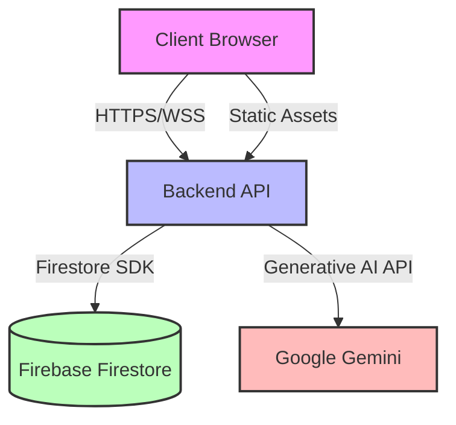
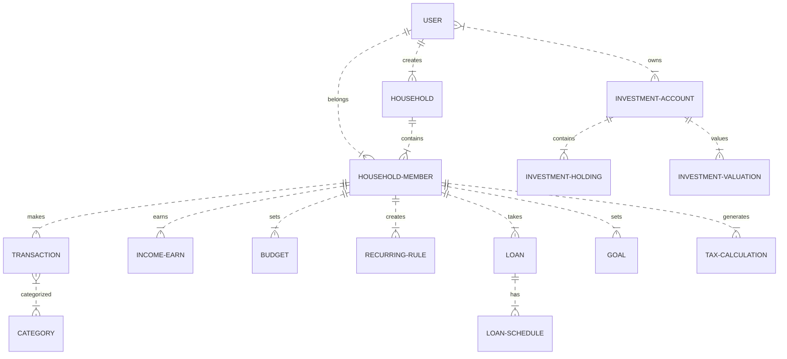
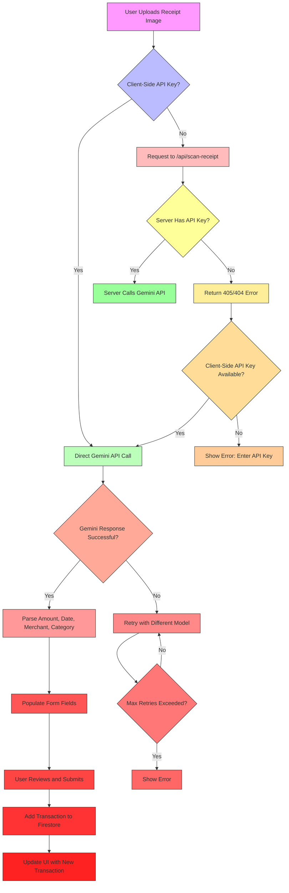
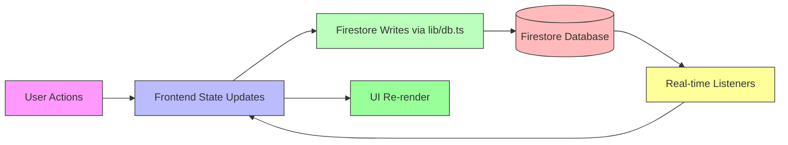
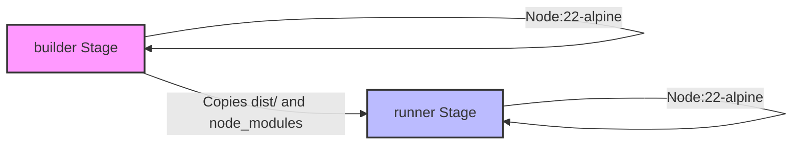
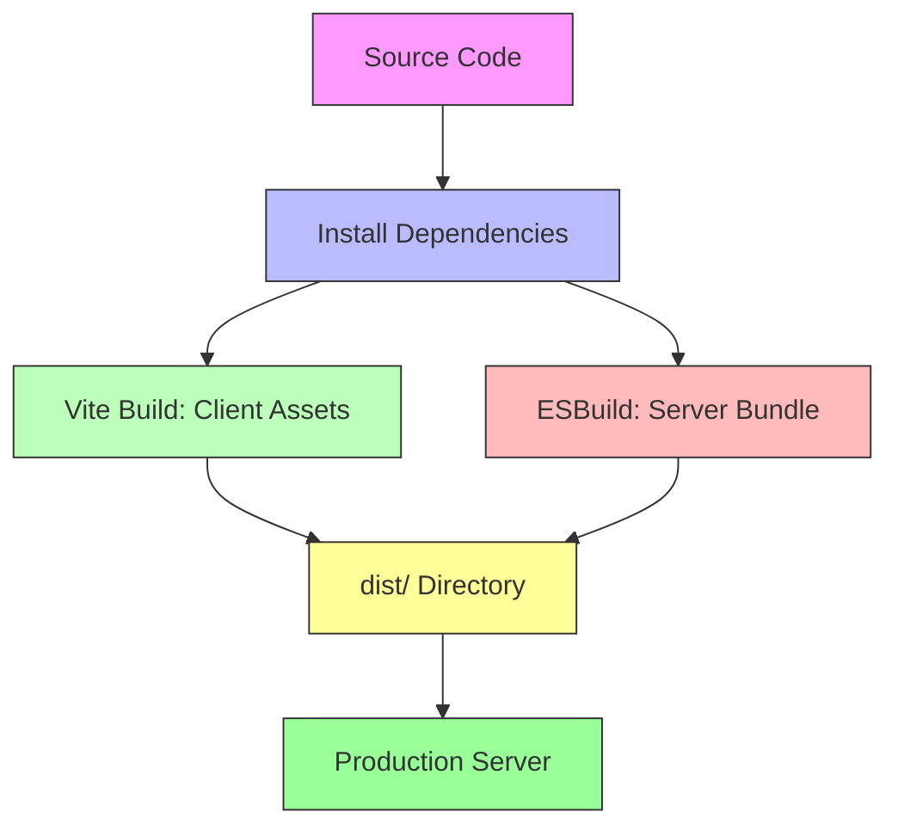

# Expense Planner

A comprehensive personal and family finance management application with AI-powered receipt scanning, multi-user household support, and sophisticated financial tracking.

## Table of Contents

- [Project Overview](#project-overview)
- [Key Features](#key-features)
- [Technology Stack](#technology-stack)
- [Architecture](#architecture)
- [Directory Structure](#directory-structure)
- [Frontend Architecture](#frontend-architecture)
- [Backend Architecture](#backend-architecture)
- [Database Architecture](#database-architecture)
- [API Reference](#api-reference)
- [Authentication & Authorization](#authentication--authorization)
- [Core Feature Workflows](#core-feature-workflows)
- [Data Flow](#data-flow)
- [Configuration](#configuration)
- [Environment Variables](#environment-variables)
- [Installation & Local Development](#installation--local-development)
- [Database Setup](#database-setup)
- [Testing](#testing)
- [Docker](#docker)
- [Build Process](#build-process)
- [CI/CD](#ci-cd)
- [Deployment](#deployment)
- [Security](#security)
- [Performance](#performance)
- [Error Handling](#error-handling)
- [Troubleshooting](#troubleshooting)
- [Extending the Application](#extending-the-application)
- [Architectural Decisions](#architectural-decisions)
- [Known Limitations](#known-limitations)
- [FAQ](#faq)
- [Glossary](#glossary)
- [Contributing](#contributing)
- [License](#license)

## Project Overview

Expense Planner is a full-stack web application designed for personal and family financial management. It enables users to track income, expenses, budgets, loans, investments, and goals with AI-powered receipt scanning capabilities. The application supports multi-user households with role-based access (primary, spouse, dependent) and provides comprehensive financial reporting.

Built with React/Vite frontend and Node.js/Express backend, the application uses Firebase Firestore as its primary database and integrates with Google's Gemini AI for receipt processing. The application can be deployed via Docker, Vercel (serverless functions), or traditional Node.js hosting.

## Key Features

- **AI-Powered Receipt Scanning**: Upload receipt images to automatically extract amount, date, merchant, and category using Google Gemini AI
- **Multi-User Household Support**: Create or join households with role-based permissions (primary, spouse, dependent)
- **Comprehensive Financial Tracking**:
  - Income tracking with detailed breakdown (basic, HRA, allowances, bonuses, deductions)
  - Expense categorization with customizable categories
  - Budget management with monthly limits per category
  - Loan & EMI tracking with amortization schedules
  - Investment portfolio tracking
  - Savings goals with target amounts and dates
  - Tax calculations for old vs new regime comparison
- **Recurring Transactions**: Automate regular expenses and incomes with flexible frequency (monthly, quarterly, yearly)
- **Data Export**: Export financial reports in various formats
- **Responsive Design**: Mobile-friendly interface with adaptive layouts
- **Theme Support**: Light/dark mode with system preference detection
- **Secure Authentication**: Firebase Auth with email/password providers
- **Offline Capabilities**: Firestore persistence for intermittent connectivity
- **Dual Deployment Options**: Run as traditional Express server (Docker/Node.js) or Vercel serverless functions
- **CI/CD Pipeline**: GitHub Actions workflow for linting, testing, building, security auditing, and automated deployment to Vercel and Docker registry

## Technology Stack

### Frontend

- **React 19**: UI library for building interactive components
- **Vite 6**: Build tool and development server for fast module replacement
- **React Router DOM 7**: Client-side routing for SPA navigation
- **Tailwind CSS 4**: Utility-first CSS framework for styling
- **Headless UI**: Accessible UI components (via Heroicons/lucide-react)
- **Firebase JavaScript SDK**: Auth and Firestore integration
- **Lucide React**: Beautifully designed icon set
- **Recharts**: Charting library for data visualization
- **JSPdf**: PDF generation for reports
- **Heic2any**: HEIC image format conversion for iOS photos

### Backend

- **Node.js**: JavaScript runtime
- **Express 4**: Web framework for API server
- **Firebase Admin SDK**: Server-side Firestore access
- **Google Generative AI (@google/genai)**: Gemini AI integration for receipt scanning
- **Express Rate Limit**: Request throttling for abuse prevention
- **Dotenv**: Environment variable loading
- **TSX**: TypeScript execution for development
- **ESBuild**: Bundling for production server
- **Vercel**: Serverless functions platform (api/scan-receipt.ts)

### Database

- **Firebase Firestore**: NoSQL document database with real-time capabilities
- **Firebase Authentication**: User authentication service

### DevOps & Infrastructure

- **Docker**: Containerization with multi-stage build
- **Docker Compose**: Orchestration for local development
- **Vercel**: Serverless deployment platform
- **GitHub Actions**: CI/CD pipeline (lint, test, build, security audit, deploy)
- **Bun**: Package manager (indicated by bun.lockb)
- **GHCR**: GitHub Container Registry for Docker image storage

### Development Tools

- **TypeScript**: Static typing for JavaScript
- **ESLint**: Code linting (via tsc --noEmit)
- **Prettier**: Code formatting (configured via editor settings)

## Architecture

The application follows a three-tier architecture with dual deployment options:



### High-Level Components

1. **Client Layer**: React/Vite SPA handling UI rendering and user interactions
2. **API Layer**:
   - Express server (local/Docker) handling business logic and data validation
   - Vercel serverless function (`api/scan-receipt.ts`) for AI receipt processing in serverless environments
3. **Data Layer**: Firestore for persistent storage with caching layer
4. **External Services**: Google Gemini AI for receipt processing, Firebase Auth for authentication

### Communication Patterns

- Client ↔ API: RESTful JSON over HTTPS
- API ↔ Firestore: Firebase Admin SDK (direct database access)
- API ↔ Gemini: HTTP POST to generativelanguage.googleapis.com
- Client ↔ Gemini (fallback): Direct API calls when configured with client-side key

## Directory Structure

```
expense-planner/
├── src/                    # Frontend source code
│   ├── components/         # Reusable UI components
│   ├── contexts/           # React context providers (Auth, Theme)
│   ├── lib/                # Backend-service libraries (Firebase, utils)
│   ├── pages/              # Page components (Dashboard, Login)
│   ├── types.ts            # TypeScript interfaces and enums
│   ├── App.tsx             # Root application component
│   └── main.tsx            # Application entry point
├── server.ts               # Backend Express server
├── api/                    # Vercel serverless functions
│   └── scan-receipt.ts     # AI receipt scanning endpoint for Vercel
├── lib/                    # Backend-specific libraries (if separate)
├── public/                 # Static assets
├── dist/                   # Build output (generated)
├── Dockerfile              # Multi-stage Docker build
├── docker-compose.yml      # Container orchestration
├── vercel.json             # Vercel platform configuration
├── package.json            # Dependencies and scripts
├── tsconfig.json           # TypeScript configuration
├── .github/                # GitHub Actions workflows
│   └── workflows/
│       └── ci-cd.yml       # CI/CD pipeline
└── firebase-applet-config.json # Fallback Firebase configuration
```

## Frontend Architecture

The frontend is a single-page application built with React and Vite, utilizing a context-based state management approach for authentication and theme state.

### Core Architecture

```mermaid
flowchart LR
    A[Browser] --> B[Index.html]
    B --> C[React Root]
    C --> D[ThemeProvider]
    D --> E[AuthProvider]
    E --> F[BrowserRouter]
    F --> G[Routes]
    G --> H[/login Login Page]
    G --> I[/ Dashboard]
    I --> J[ProtectedRoute Wrapper]
    J --> K[Dashboard Layout]
    K --> L[Section Components]
    L --> M[OverviewSection]
    L --> N[ExpenseSection]
    L --> O[IncomeSection]
    L --> P[BudgetSection]
    L --> Q[...Other Sections]
    style A fill:#f9f,stroke:#333,stroke-width:1px
    style B fill:#eee,stroke:#333,stroke-width:1px
    style C fill:#dfd,stroke:#333,stroke-width:1px
    style D fill:#cfc,stroke:#333,stroke-width:1px
    style E fill:#bfb,stroke:#333,stroke-width:1px
    style F fill:#afa,stroke:#333,stroke-width:1px
    style G fill:#9f9,stroke:#333,stroke-width:1px
    style H fill:#fe9,stroke:#333,stroke-width:1px
    style I fill:#fd9,stroke:#333,stroke-width:1px
    style J fill:#fc9,stroke:#333,stroke-width:1px
    style K fill:#fb9,stroke:#333,stroke-width:1px
    style L fill:#fa9,stroke:#333,stroke-width:1px
    style M fill:#f99,stroke:#333,stroke-width:1px
    style N fill:#f88,stroke:#333,stroke-width:1px
    style O fill:#f77,stroke:#333,stroke-width:1px
    style P fill:#f66,stroke:#333,stroke-width:1px
    style Q fill:#f55,stroke:#333,stroke-width:1px
```

### State Management

- **AuthContext**: Manages Firebase user state, household membership, and loading states
- **ThemeContext**: Handles light/dark mode preferences with system detection
- **React Query-like Caching**: Custom caching layer in lib/db.ts for Firestore queries with 25s TTL
- **Local State**: Component-level state for form inputs and UI flags

### Key Components

- **ExpenseSection**: Primary interface for logging expenses with AI receipt scanning
- **Dashboard**: Main layout with tabbed navigation for different financial sections
- **AuthContext**: Firebase authentication wrapper with automatic household creation
- **ThemeContext**: CSS variable-based theming with Tailwind CSS integration
- **ReceiptScanner**: Library handling client-server fallback for Gemini AI integration

## Backend Architecture

The backend is a Node.js Express server that handles API requests, business logic, and Firebase interactions. A Vercel serverless function provides the same AI receipt scanning capability for serverless deployments.

### Request Flow (Express Server)

```mermaid
sequenceDiagram
    participant C as Client
    participant S as Express Server
    participant F as Firestore
    participant G as Gemini AI

    C->>S: HTTPS Request (e.g., POST /api/scan-receipt)
    S->>S: Validate middleware (rate limiting, JSON parsing)
    alt Has Gemini API Key in request
        S->>G: Call Generative AI API
        G-->>S: Return structured receipt data
    else
        S->>F: Fetch/user data if needed
        S-->>S: Process locally (if applicable)
    end
    S->>F: Store/retrieve transaction data
    F-->>S: Return Firestore response
    S-->>C: JSON Response with data/error

    style C fill:#f9f,stroke:#333,stroke-width:1px
    style S fill:#bbf,stroke:#333,stroke-width:1px
    style F fill:#bfb,stroke:#333,stroke-width:1px
    style G fill:#fbb,stroke:#333,stroke-width:1px
```

### Request Flow (Vercel Serverless Function)

```mermaid
sequenceDiagram
    participant C as Client
    participant V as Vercel Function
    participant G as Gemini AI

    C->>V: HTTPS Request (POST /api/scan-receipt)
    V->>V: Validate middleware (JSON parsing, body size limit)
    alt Has Gemini API Key in environment
        V->>G: Call Generative AI API
        G-->>V: Return structured receipt data
    else
        V-->>V: Return error (missing API key)
    end
    V->>F: Store/retrieve transaction data (if needed via Firebase Admin SDK)
    F-->>V: Return Firestore response
    V-->>C: JSON Response with data/error

    style C fill:#f9f,stroke:#333,stroke-width:1px
    style V fill:#bbf,stroke:#333,stroke-width:1px
    style G fill:#fbb,stroke:#333,stroke-width:1px
    style F fill:#bfb,stroke:#333,stroke-width:1px
```

### Middleware (Express)

1. **express.json()**: Body parsing with 25MB limit
2. **express-rate-limit**:
   - Global: 100 requests/15min/IP
   - Scan receipt: 10 requests/hour/IP (expensive AI operations)
3. **Vite Middleware**: In development, serves client SPA and enables HMR
4. **Static File Serving**: In production, serves built client assets

### Middleware (Vercel Function)

- Built-in body parser with 10MB limit (see `api/scan-receipt.ts` config)
- Automatic runtime isolation and scaling

### Core Modules

- **server.ts**: Main entry point with route definitions and middleware setup
- **api/scan-receipt.ts**: Vercel serverless function for AI receipt scanning
- **Firebase Integration**: Initialized in src/lib/firebase.ts with fallback configuration
- **Receipt Scanning**: Google Gemini AI integration with multiple model fallbacks
- **Error Handling**: Centralized error logging with Firestore operation tracking

## Database Architecture

The application uses Firebase Firestore as its primary database with a denormalized schema optimized for financial data access patterns.

### Entity Relationship Diagram



### Collections Structure

#### households

- `name`: string
- `created_by`: string (userId)
- `created_at`: timestamp

#### household_members

- `household_id`: string (reference to households)
- `user_id`: string (reference to Firebase Auth users)
- `email`: string
- `role`: string (primary/spouse/dependent/other)
- `joined_at`: timestamp

#### transactions

- `user_id`: string
- `household_id`: string (optional, for household-scoped transactions)
- `category_id`: string (references category name)
- `amount`: number
- `date`: string (YYYY-MM-DD)
- `note`: string
- `payment_mode`: string (UPI/Card/Cash/Netbanking/Other)
- `source`: string (manual/recurring/csv_import)
- `created_at`: timestamp

#### income_entries

- `user_id`: string
- `household_id`: string (optional)
- `month`: string (YYYY-MM)
- `basic`, `hra`, `special_allowance`, `bonus`, `other`: numbers
- `epf_deduction`, `professional_tax`, `tds`: numbers
- `net_credited`: number
- `created_at`: timestamp

#### budgets

- `user_id`: string
- `household_id`: string (optional)
- `category_id`: string
- `month`: string (YYYY-MM)
- `limit_amount`: number
- `created_at`: timestamp

#### recurring_rules

- `user_id`: string
- `household_id`: string (optional)
- `category_id`: string
- `amount`: number
- `frequency`: string (monthly/quarterly/yearly)
- `next_due_date`: string (YYYY-MM-DD)
- `label`: string
- `active`: boolean
- `created_at`: timestamp

#### loans

- `user_id`: string
- `household_id`: string (optional)
- `principal`: number
- `interest_rate`: number (annual percentage)
- `tenure_months`: number
- `start_date`: string (YYYY-MM-DD)
- `emi_amount`: number
- `created_at`: timestamp

#### loan_schedules

- `loan_id`: string
- `user_id`: string
- `household_id`: string (optional)
- `month_number`: number
- `principal_component`: number
- `interest_component`: number
- `outstanding_balance`: number
- `is_prepayment`: boolean

#### goals

- `user_id`: string
- `household_id`: string (optional)
- `name`: string
- `target_amount`: number
- `target_date`: string (YYYY-MM-DD)
- `current_amount`: number
- `linked_recurring_rule_id`: string (nullable)
- `created_at`: timestamp

#### tax_calculations

- `user_id`: string
- `financial_year`: string
- `gross_income`: number
- `hra_exemption`: number
- `eighty_c`: number
- `eighty_d`: number
- `home_loan_interest`: number
- `other_deductions`: number
- `old_regime_tax`: number
- `new_regime_tax`: number
- `recommended_regime`: string (old/new)
- `created_at`: timestamp

#### categories

- `user_id`: string (or "system" for defaults)
- `name`: string
- `type`: string (fixed/custom)
- `is_default`: boolean
- `created_at`: timestamp

#### investment_accounts

- `user_id`: string
- `household_id`: string (optional)
- `type`: string (mutual_fund/stock/fd/ppf/nps/gold/other)
- `custom_type_description`: string (optional)
- `name`: string
- `folio_number`: string (optional)
- `created_at`: timestamp

#### investment_holdings

- `investment_account_id`: string
- `user_id`: string
- `units`: number (nullable)
- `amount`: number (for FD/PPF)
- `purchase_price`: number
- `purchase_date`: string (YYYY-MM-DD)
- `created_at`: timestamp

#### investment_valuations

- `investment_account_id`: string
- `user_id`: string
- `date`: string (YYYY-MM-DD)
- `price_or_nav`: number
- `total_value`: number
- `created_at`: timestamp

### Indexing Strategy

Firestore automatically creates indexes for:

- Single field queries
- Compound queries based on query patterns in the code
- Collection group queries (not used)

The application relies on Firestore's automatic indexing for most queries, with composite indexes implicitly created through query patterns.

## API Reference

### Health Check

| Method | Endpoint      | Auth | Purpose                                    |
| ------ | ------------- | ---- | ------------------------------------------ |
| GET    | `/api/health` | None | Returns server status and environment info |

### Receipt Scanning

| Method | Endpoint            | Auth                | Purpose                                             |
| ------ | ------------------- | ------------------- | --------------------------------------------------- |
| POST   | `/api/scan-receipt` | None (rate limited) | Upload receipt image for AI-powered data extraction |

**Request Body:**

```json
{
  "imageBase64": "string (base64 encoded image)",
  "mimeType": "string (e.g., image/jpeg, image/png)"
}
```

**Success Response (200):**

```json
{
  "amount": number,
  "date": "string (YYYY-MM-DD)",
  "merchant": "string",
  "category": "string"
}
```

**Error Responses:**

- 400: Missing image data
- 429: Rate limit exceeded (10 requests/hour/IP for Express; Vercel function has its own limits)
- 500: AI processing failure or server error
- 503: Gemini service unavailable (transient)

### Rate Limiting

- **Express Server**:
  - Global Limiter: 100 requests per 15 minutes per IP address
  - Scan Receipt Limiter: 10 requests per hour per IP address (protects expensive AI operations)
- **Vercel Function**: Inherits Vercel's default limits (can be adjusted in vercel.json if needed)

### Security Headers

All responses include:

- `X-Content-Type-Options: nosniff`

### CORS

Configured implicitly through Express - allows all origins in development, restricted in production via frontend proxying. Vercel functions follow Vercel's CORS handling.

## Authentication & Authorization

### Authentication Flow

```mermaid
sequenceDiagram
    participant U as User
    participant B as Browser
    participant F as Firebase Auth
    participant S as Express Server
    participant V as Vercel Function
    participant DB as Firestore

    U->>B: Visit /login
    B->>F: Sign in with email/password
    F-->>B: Auth token (ID token)
    B->>S/V: Include token in subsequent requests (via Firebase SDK)
    S->>F: Verify token via Firebase Admin SDK
    V->>F: Verify token via Firebase Admin SDK (if needed)
    F-->>S/V: Token validity and user info
    S->>DB: Fetch household membership
    V->>DB: Fetch household membership (if needed)
    DB-->>S/V: Household data
    S-->>B: Authenticated response
    V-->>B: Authenticated response

    style U fill:#f9f,stroke:#333,stroke-width:1px
    style B fill:#bbf,stroke:#333,stroke-width:1px
    style F fill:#bfb,stroke:#333,stroke-width:1px
    style S fill:#fbb,stroke:#333,stroke-width:1px
    style V fill:#9f9,stroke:#333,stroke-width:1px
    style DB fill:#ff9,stroke:#333,stroke-width:1px
```

### Authorization Model

- **Resource Ownership**: Most data is scoped by `user_id` or `household_id`
- **Household Scoping**:
  - Primary members can view/edit all household data
  - Spouse members have similar privileges to primary
  - Dependent members have restricted access (cannot modify certain settings)
  - Role-based visibility in UI (see Dashboard.tsx visibleTabs filtering)
- **Data Access Rules**:
  - Transactions, incomes, budgets: Scoped to household_id when available, fallback to user_id
  - Invites: Household-specific invitation system
  - Investment data: Can be household-scoped or personal

### Authentication Implementation

- **Frontend**: Firebase JavaScript SDK (`src/lib/firebase.ts`)
- **Backend**: Firebase Admin SDK for token verification (implicit in Firestore security rules)
- **Serverless Functions**: Firebase Admin SDK initialized via environment variables
- **Session Management**: Firebase ID tokens stored client-side, verified on each request via Firestore rules
- **Password Security**: Firebase Auth handles secure password storage with hashing and salting

### Protected Routes

All routes except `/login` are protected by the `ProtectedRoute` component which:

1. Checks AuthContext for user and loading state
2. Redirects to `/login` if not authenticated
3. Shows loading spinner during initialization

## Core Feature Workflows

### Receipt Scanning Workflow



### Transaction Lifecycle

```mermaid
sequenceDiagram
    participant U as User
    participant C as Client (React)
    participant S as Server (Express)
    participant V as Vercel Function
    participant F as Firestore

    U->>C: Fill expense form (manual or via scan)
    C->>S: POST /api/scan-receipt (if scanning) OR direct form submission
    C->>V: POST /api/scan-receipt (if scanning via Vercel) OR direct form submission
    alt Scanning Path
        S->>F: (Optional) Fetch user/household data
        S->>Gemini: AI processing
        Gemini-->>S: Extracted data
        S-->>C: Return scanned data
        V->>F: (Optional) Fetch user/household data
        V->>Gemini: AI processing
        Gemini-->>V: Extracted data
        V-->>C: Return scanned data
    end
    C->>C: Populate form with scanned data
    C->>S: POST transaction data (via addTransaction in lib/db.ts)
    C->>V: POST transaction data (via addTransaction in lib/db.ts) (if using Vercel)
    S->>F: Validate and insert transaction document
    V->>F: Validate and insert transaction document
    F-->>S/V: Confirmation with document ID
    S/V-->>C: Success response
    C->>C: Clear form, refetch transactions list
    C->>U: Show updated expense list

    style U fill:#f9f,stroke:#333,stroke-width:1px
    style C fill:#bbf,stroke:#333,stroke-width:1px
    style S fill:#bfb,stroke:#333,stroke-width:1px
    style V fill:#9f9,stroke:#333,stroke-width:1px
    style F fill:#fbb,stroke:#333,stroke-width:1px
```

### Household Invitation Workflow

```mermaid
sequenceDiagram
    actor P as Primary Member
    actor S as System
    actor F as Firebase
    actor I as Invitee

    P->>S: Request invite for email
    S->>F: Create invite document with code & expiry
    F-->>S: Invite created
    S-->>P: Return invite code
    P->>I: Share invite code
    I->>S: Submit email + invite code
    S->>F: Validate invite (pending, not expired)
    F-->>S: Valid invite
    S->>F: Create/update household membership
    S->>F: Mark invite as accepted
    S-->>I: Success - redirect to app

    style P fill:#f9f,stroke:#333,stroke-width:1px
    style S fill:#bbf,stroke:#333,stroke-width:1px
    style F fill:#bfb,stroke:#333,stroke-width:1px
    style I fill:#fbb,stroke:#333,stroke-width:1px
```

## Data Flow

### Receipt Scanning Data Flow

1. **Input**: User selects image file (JPG, PNG, HEIC)
2. **Processing**:
   - Client converts HEIC to JPEG if needed (`processImageForOCR`)
   - Attempts direct Gemini call if client API key available
   - Falls back to `/api/scan-receipt` endpoint (Express or Vercel)
   - Server validates image and calls Gemini AI with multiple model fallbacks
3. **Output**: JSON with `{amount, date, merchant, category}`
4. **Consumption**: Frontend populates form fields with extracted data
5. **Storage**: On form submit, transaction saved to Firestore transactions collection

### Monthly Data Flow



### Cache Flow

The application implements a multi-layer caching strategy:

1. **Memory Cache**: 25-second TTL for frequently accessed data (transactions, budgets, etc.)
2. **Household Cache**: 30-second TTL for household-related data
3. **Firestore**: Persistent storage with automatic indexing
4. **Client-Side**: LocalStorage for Gemini API key (optional)

## Configuration

### Important Files

- `vite.config.ts`: Vite build configuration with React plugin and Tailwind integration
- `tsconfig.json`: TypeScript configuration with strict mode and path mapping
- `server.ts`: Express server configuration and middleware
- `api/scan-receipt.ts`: Vercel serverless function for AI receipt scanning
- `Dockerfile`: Multi-stage container build instructions
- `docker-compose.yml`: Service definition for local development
- `vercel.json`: Vercel platform configuration for serverless functions
- `.github/workflows/ci-cd.yml`: GitHub Actions CI/CD pipeline
- `.env.example`: Template for environment variables

### Build Configuration

**vite.config.ts**:

- Plugins: `@vitejs/plugin-react`
- Build: `outDir: dist`, `emptyOutDir: true`
- Server: Proxy configuration for development (if needed)

**tsconfig.json**:

- Target: ES2020
- Module: ESNext
- ModuleResolution: Bundler
- Strict: true
- NoEmit: true (lint-only checking)
- JSX: react-jsx

## Environment Variables

| Variable                            | Required                                  | Purpose                                         | Used By                                                                                |
| ----------------------------------- | ----------------------------------------- | ----------------------------------------------- | -------------------------------------------------------------------------------------- |
| `GEMINI_API_KEY`                    | No (but recommended for receipt scanning) | Google Gemini API key for AI receipt processing | Backend server (`server.ts`), Vercel function (`api/scan-receipt.ts`), Client fallback |
| `VITE_GEMINI_API_KEY`               | No                                        | Client-side fallback API key for static hosting | Frontend (`src/lib/receiptScanner.ts`)                                                 |
| `NODE_ENV`                          | Yes (defaults to production)              | Environment mode (development/production)       | Build scripts, server.ts                                                               |
| `PORT`                              | Yes (defaults to 3000)                    | HTTP port for server                            | server.ts, Dockerfile, docker-compose                                                  |
| `APP_URL`                           | No                                        | Application URL for email links                 | Not actively used in codebase                                                          |
| `VITE_FIREBASE_API_KEY`             | Yes (via fallback)                        | Firebase API key                                | Frontend Firebase initialization                                                       |
| `VITE_FIREBASE_AUTH_DOMAIN`         | Yes (via fallback)                        | Firebase Auth domain                            | Frontend Firebase initialization                                                       |
| `VITE_FIREBASE_PROJECT_ID`          | Yes (via fallback)                        | Firebase project ID                             | Frontend Firebase initialization                                                       |
| `VITE_FIREBASE_STORAGE_BUCKET`      | Yes (via fallback)                        | Firebase storage bucket                         | Frontend Firebase initialization                                                       |
| `VITE_FIREBASE_MESSAGING_SENDER_ID` | Yes (via fallback)                        | Firebase messaging sender ID                    | Frontend Firebase initialization                                                       |
| `VITE_FIREBASE_APP_ID`              | Yes (via fallback)                        | Firebase app ID                                 | Frontend Firebase initialization                                                       |
| `VITE_FIREBASE_DATABASE_ID`         | No (defaults to "(default)")              | Firestore database ID                           | Frontend Firebase initialization                                                       |
| `VERCEL_TOKEN`                      | No (for CI/CD)                            | Vercel CLI token for deployments                | GitHub Actions (`deploy-preview`, `deploy-production`)                                 |
| `SNYK_TOKEN`                        | No (for CI/CD)                            | Snyk token for security scanning                | GitHub Actions (`security-audit`)                                                      |
| `GITHUB_TOKEN`                      | No (for CI/CD)                            | GitHub token for Docker registry login          | GitHub Actions (`docker-build`)                                                        |

> **Note**: Firebase configuration values have fallbacks defined in `firebase-applet-config.json` and hardcoded defaults in `src/lib/firebase.ts` to ensure out-of-the-box functionality.

## Installation & Local Development

### Prerequisites

- **Node.js**: Version 22.x or later
- **Package Manager**: Bun (recommended) or npm/yarn
- **Firebase Project**: Optional for full functionality (fallback config provides limited demo mode)
- **Gemini API Key**: Optional for receipt scanning (get free key from [Google AI Studio](https://aistudio.google.com/app/apikey))
- **Vercel Account** (optional): For deploying preview/production via GitHub Actions

### Setup Steps

1. **Clone the Repository**

   ```bash
   git clone <repository-url>
   cd expense-planner
   ```

2. **Install Dependencies**

   ```bash
   # Using bun (recommended)
   bun install

   # Or using npm
   npm install
   ```

3. **Configure Environment Variables**

   ```bash
   cp .env.example .env
   # Edit .env to add your GEMINI_API_KEY (optional)
   # Firebase configuration uses fallbacks, but you can override via:
   # VITE_FIREBASE_API_KEY=your_key etc.
   # For Vercel deployments via GitHub Actions, set secrets in repo settings
   ```

4. **Start Development Server**

   ```bash
   # Using bun
   bun run dev

   # Or using npm
   npm run dev
   ```

   The application will be available at [http://localhost:3000](http://localhost:3000)

5. **Build for Production**

   ```bash
   # Using bun
   bun run build

   # Or using npm
   npm run build
   ```

   Outputs to `dist/` directory

6. **Start Production Server (Express)**

   ```bash
   # Using bun
   bun run start

   # Or using npm
   npm run start
   ```

   Serves the built application from `dist/server.cjs`

### Firebase Setup (Optional)

For full functionality with your own Firebase project:

1. Create a Firebase project at [console.firebase.google.com](https://console.firebase.google.com/)
2. Enable Authentication (Email/Password provider)
3. Enable Firestore Database
4. Add your web app to get configuration values
5. Set the following environment variables in `.env`:
   ```
   VITE_FIREBASE_API_KEY=your_api_key
   VITE_FIREBASE_AUTH_DOMAIN=your_project_id.firebaseapp.com
   VITE_FIREBASE_PROJECT_ID=your_project_id
   VITE_FIREBASE_STORAGE_BUCKET=your_project_id.appspot.com
   VITE_FIREBASE_MESSAGING_SENDER_ID=your_sender_id
   VITE_FIREBASE_APP_ID=your_app_id
   ```
6. (Optional) Set `VITE_FIREBASE_DATABASE_ID` if using a non-default database

## Database Setup

The application uses Firebase Firestore which requires minimal setup:

### Automatic Initialization

- On first launch, the application creates necessary collections implicitly through writes
- Default categories are provided in code (`DEFAULT_CATEGORIES` in types.ts)
- Households are created automatically when users sign in without an existing membership

### Security Rules

For production use with your own Firebase project, configure Firestore rules to ensure data security. Example rules:

```
rules_version = '2';
service cloud.firestore {
  match /databases/{database}/documents {
    // Users can only read/write their own data or household-scoped data
    match /{document=**} {
      allow read, write: if request.auth != null &&
        (resource.data.user_id == request.auth.uid ||
         resource.data.household_id in get(/databases/$(database)/documents/household_members/$(request.auth.uid)).data.household_id);
    }
  }
}
```

> **Note**: The application includes fallback Firebase configuration for demonstration purposes. For production deployments, it is strongly recommended to use your own Firebase project.

## Testing

The application does not include a dedicated test suite in the current codebase. Development relies on manual testing and browser-based verification.

### Testing Approach

1. **Manual Verification**: Feature testing through UI interaction
2. **Build Validation**: Ensuring production build succeeds (`npm run build`)
3. **Type Checking**: TypeScript compilation check (`npm run lint` runs `tsc --noEmit`)
4. **Endpoint Testing**: Manual API testing via tools like Postman or curl
5. **CI/CD**: GitHub Actions runs lint, typecheck, tests, security audit on every push/PR

### Recommended Testing Additions

For production readiness, consider adding:

- **Unit Tests**: Using Jest or Vitest for utility functions
- **Integration Tests**: Using supertest for API endpoints
- **End-to-End Tests**: Using Cypress or Playwright for user flows
- **Snapshot Testing**: For React components

## Docker

The application includes production-ready Docker configuration for containerized deployment.

### Multi-Stage Build

The Dockerfile implements a two-stage build process:



#### Stage 1: Builder

- **Base**: `node:22-alpine`
- **Actions**:
  - Install all dependencies (including devDependencies)
  - Copy source code
  - Run `npm run build` to generate frontend assets and bundle server
- **Output**: Complete application build in `/app/dist`

#### Stage 2: Runner

- **Base**: `node:22-alpine`
- **Actions**:
  - Install production dependencies only (`--omit=dev`)
  - Copy built assets from builder stage
  - Set environment variables (`NODE_ENV=production`, `PORT=3000`)
  - Expose port 3000
  - Launch `node dist/server.cjs`

### Usage Instructions

#### Quick Start with Docker Compose

```bash
docker compose up --build
```

Access at [http://localhost:3000](http://localhost:3000)

#### Manual Docker Usage

```bash
# Build image
docker build -t expense-planner .

# Run container
docker run -d \
  -p 3000:3000 \
  --name expense-planner-app \
  -e GEMINI_API_KEY="your-key-here" \
  expense-planner
```

#### Environment Variables in Docker

Pass variables using `-e` flag or `--env-file`:

```bash
docker run -d \
  -p 3000:3000 \
  -e GEMINI_API_KEY="your_key" \
  -e NODE_ENV=production \
  -e PORT=3000 \
  expense-planner
```

### Image Characteristics

- **Size**: Approximately 150-200MB (multi-stage optimization)
- **Layers**: Optimized for caching and rebuild efficiency
- **Security**: Runs as non-root node user (default in node:alpine images)
- **Healthcheck**: Not implemented; consider adding for production orchestration

## Build Process

The build process transforms source code into deployable assets:



### Stages

1. **Dependency Installation**: `npm ci` (or `bun install`)
2. **Frontend Build**: Vite compiles React application to static assets in `dist/`
   - Output: HTML, CSS, JS, assets
   - Features: Minification, code splitting, asset hashing
3. **Server Bundle**: ESBuild bundles `server.ts` into `dist/server.cjs`
   - Format: CommonJS for Node.js compatibility
   - Includes: All server-side dependencies
   - Optimization: Minification and tree-shaking
4. **Production Output**: Complete deployable application in `dist/`

### Build Commands

```bash
# Development build (fast, unoptimized)
npm run dev

# Production build (optimized)
npm run build

# Preview production build locally
npm run preview
```

### Bundle Analysis

The build output includes:

- `dist/index.html`: Application shell
- `dist/assets/`: hashed CSS and JS files
- `dist/server.cjs`: Bundled Express server
- `firebase-applet-config.json`: Firebase configuration copy

## CI/CD

The application uses GitHub Actions for continuous integration and deployment.

### Workflow Overview (`.github/workflows/ci-cd.yml`)

```mermaid
flowchart TD
    A[Push/PR to main] --> B[Lint & TypeCheck]
    A --> C[Unit Tests]
    B --> D[Build Application]
    C --> D
    D --> E[Security Audit]
    D --> F[Deploy Preview (Vercel)]
    D --> G[Deploy Production (Vercel)]
    D --> H[Build & Push Docker Image]
    E --> I[Notify on Failure]
    F --> I
    G --> I
    H --> I
```

### Jobs

1. **Lint & TypeCheck** (`ubuntu-latest`)
   - Checkout repository
   - Setup Node.js v20
   - Install dependencies (`npm ci`)
   - Run TypeScript check (`npm run lint`)
   - Check formatting (`prettier --check .`)

2. **Unit Tests** (`ubuntu-latest`)
   - Checkout repository
   - Setup Node.js v20
   - Install dependencies (`npm ci`)
   - Run tests (`npm test --if-present`)

3. **Build Application** (`ubuntu-latest`, needs lint/test)
   - Checkout repository
   - Setup Node.js v20
   - Install dependencies (`npm ci`)
   - Build application (`npm run build`)
   - Upload build artifacts (`dist/`)

4. **Security Audit** (`ubuntu-latest`, needs build)
   - Checkout repository
   - Setup Node.js v20
   - Install dependencies (`npm ci`)
   - Run `npm audit --audit-level=high`
   - Run Snyk security scan (optional, continues on error)

5. **Deploy Preview (Vercel)** (`ubuntu-latest`, needs build, if PR)
   - Checkout repository
   - Install Vercel CLI
   - Pull Vercel environment (preview)
   - Build Project Artifacts (`vercel build --prod`)
   - Deploy to Vercel Preview (`vercel deploy --prebuilt`)
   - Comment PR with Preview URL

6. **Deploy Production (Vercel)** (`ubuntu-latest`, needs build, if push to main)
   - Checkout repository
   - Install Vercel CLI
   - Pull Vercel environment (production)
   - Build Project Artifacts (`vercel build --prod`)
   - Deploy to Vercel Production (`vercel deploy --prebuilt --prod`)
   - Notify on success/failure

7. **Build & Push Docker Image** (`ubuntu-latest`, needs build, if push to main)
   - Checkout repository
   - Set up Docker Buildx
   - Log in to Container Registry (ghcr.io)
   - Extract metadata
   - Build and push Docker image (tags: SHA, ref, latest)

8. **Notify on Failure** (`ubuntu-latest`, needs all previous jobs, if failure)
   - Send failure notification (placeholder for Slack/Discord/Email)

### Environment Variables in GitHub Actions

Configure these as repository secrets:

- `VERCEL_TOKEN`: Required for Vercel deployments
- `SNYK_TOKEN`: Optional for Snyk security scanning
- `VITE_FIREBASE_API_KEY`, `VITE_FIREBASE_AUTH_DOMAIN`, `VITE_FIREBASE_PROJECT_ID`, `VITE_FIREBASE_STORAGE_BUCKET`, `VITE_FIREBASE_MESSAGING_SENDER_ID`, `VITE_FIREBASE_APP_ID`, `VITE_FIREBASE_DATABASE_ID`: Firebase configuration for builds
- `GITHUB_TOKEN`: Automatically provided for Docker registry login

## Deployment

### Vercel Deployment (via GitHub Actions)

1. Push code to GitHub/GitLab/Bitbucket
2. Ensure repository is connected to Vercel (optional; CLI uses token)
3. Add required secrets (`VERCEL_TOKEN`, Firebase vars) in repository settings
4. On push to `main` or pull request, GitHub Actions will:
   - Lint, typecheck, test, build
   - Deploy preview for PRs
   - Deploy production for pushes to `main`
   - Build and push Docker image to GHCR
5. Monitor deployment status in GitHub Actions tab

### Vercel Deployment (Manual)

1. Install Vercel CLI: `npm install -g vercel`
2. Link project: `vercel link` (or use existing)
3. Add environment variables: `vercel env add GEMINI_API_KEY` etc.
4. Deploy: `vercel --prod`

### Docker Deployment

See [Docker](#docker) section for containerized deployment options

### Traditional Node.js Deployment

1. Ensure Node.js 22+ is installed
2. Copy application files to server
3. Run `npm install --omit=dev`
4. Build: `npm run build`
5. Start: `NODE_ENV=production node dist/server.cjs`
6. Configure reverse proxy (NGINX/Apache) for port forwarding and SSL
7. Set environment variables via process env or `.env` file

### Cloud Platforms

- **AWS**: Deploy to EC2, ECS, or Lambda (with adapter)
- **Google Cloud**: Deploy to Cloud Run or App Engine
- **Azure**: Deploy to App Service or Container Instances
- **Netlify**: Possible with serverless functions configuration

### Post-Deployment Checklist

- [ ] Verify `GEMINI_API_KEY` is set for receipt scanning
- [ ] Confirm Firebase connection works (test login and data save)
- [ ] Test receipt scanning functionality with sample image
- [ ] Validate household creation and invitation flow
- [ ] Check responsive design on mobile devices
- [ ] Monitor error logs for any unexpected issues
- [ ] For Vercel: Check function logs in Vercel dashboard
- [ ] For Docker: Check container logs (`docker logs`)

## Security

### Implemented Security Controls

- **Rate Limiting**:
  - Global: 100 requests/15min/IP (Express)
  - Receipt Scanning: 10 requests/hour/IP (Express)
  - Vercel functions use platform defaults
- **Input Validation**:
  - Server-side validation for all API endpoints
  - Client-side form validation with HTML5 constraints
- **Secure Headers**:
  - `X-Content-Type-Options: nosniff` on all responses
  - Additional headers configurable via middleware
- **Authentication**:
  - Firebase Auth with industry-standard password hashing
  - ID token verification for API access (implicit via Firestore rules)
- **Authorization**:
  - Resource ownership enforced through `user_id` and `household_id` scoping
  - Role-based UI elements for household members
- **Data Protection**:
  - Firestore encryption at rest and in transit
  - Environment variable separation for secrets
- **Dependency Management**:
  - Locked versions via package-lock.json and bun.lockb
  - Regular updates recommended for security patches
- **CI/CD Security**:
  - npm audit and Snyk scan in pipeline
  - Secrets managed via GitHub repository secrets

### Recommended Improvements

- **Helmet.js**: Add HTTP header middleware for additional protections
- **CORS Policy**: Implement explicit CORS origins instead of wildcard
- **Request Sanitization**: Add middleware for SQL/noSQL injection prevention (though Firestore is injection-resistant)
- **Helmet Middleware**: Consider for Express to set additional security headers
- **Audit Logging**: Implement structured logging for security-relevant events
- **Password Policies**: Consider enforcing minimum password strength via Firebase Auth settings
- **Session Management**: Implement explicit session expiration on client-side
- **Content Security Policy**: Add CSP headers to mitigate XSS risks
- **Regular Dependency Updates**: Establish schedule for updating npm/bun packages

### Known Security Considerations

- **Firebase Configuration**: The fallback configuration in `firebase-applet-config.json` should not be used for production with sensitive data
- **Client-Side API Keys**: Storing Gemini API keys in LocalStorage presents XSS risk; consider using httpOnly cookies if SameSite attributes are properly configured
- **File Uploads**: Receipt scanning accepts image files; ensure backend validates file types and sizes (currently 25MB limit via express.json)
- **Information Disclosure**: Error messages may reveal implementation details; consider generic messages in production
- **Supply Chain**: Monitor dependencies for vulnerabilities via CI/CD pipeline

## Performance

### Optimizations Implemented

- **Multi-Stage Docker Build**: Minimizes production image size
- **Vite Build Optimization**:
  - Code splitting for route-based chunking
  - Asset hashing for cache busting
  - CSS extraction and minimization
- **ESBuild Server Bundle**: Fast, efficient bundling for Node.js
- **Firestore Caching**:
  - 25-second memory cache for frequent queries
  - 30-second household cache
  - Cache invalidation on writes
- **Image Processing**:
  - HEIC to JPEG conversion reduces file size
  - Client-side resizing for oversized images
- **Rate Limiting**: Prevents abuse and excessive resource consumption
- **Static Asset Caching**: Vercel and Docker deployments leverage browser caching
- **Serverless Functions**: Vercel provides automatic scaling and edge execution

### Performance Metrics

- **Bundle Size**: ~1.2MB gzipped for client assets (varies with dependencies)
- **Server Response Time**: <100ms for cached queries, <500ms for uncached Firestore reads
- **Receipt Scanning**: 2-5 seconds typical for Gemini API calls (network dependent)
- **First Paint**: <1s on moderate connections with warmed cache
- **Cold Start (Vercel)**: <1s for Node.js functions after initial deployment

### Potential Bottlenecks

- **Gemini API Latency**: External API call subject to network and service variability
- **Firestore Read Writes**: Unindexed queries could slow as data grows (mitigated by automatic indexing)
- **Bundle Size**: Large dependencies (firebase, google-genai) impact initial load
- **Concurrent Users**: Horizontal scaling required for high traffic (Vercel handles this automatically)
- **Image Processing**: Large HEIC files may cause temporary memory spikes during conversion
- **Serverless Concurrency**: Vercel function concurrency limits (check Vercel plan)

### Monitoring Recommendations

- Track API response times and error rates
- Monitor Firestore read/write operations and costs
- Measure client-side performance metrics (LCP, FID, CLS)
- Watch Gemini API usage and associated costs
- Observe memory usage in containerized deployments
- Monitor Vercel function invocations and duration
- Set up alerts for failed deployments or pipeline failures

## Error Handling

### Client-Side Error Handling

- **Form Validation**: HTML5 validation with custom error messages
- **API Errors**: Displayed in UI banners (scan status/error sections)
- **Loading States**: Spinners and placeholders during async operations
- **Network Errors**: Catch-all handlers for fetch failures with user-friendly messages
- **Validation Errors**: Field-specific feedback with visual cues

### Server-Side Error Handling (Express)

- **Express Error Handling**: Centralized error logging with specific service identifiers
- **Firestore Operations**:
  - `handleFirestoreError()` logs operation type, path, and auth context
  - Falls back to default data (e.g., DEFAULT_CATEGORIES) on failure
- **AI Service Errors**:
  - Multiple model fallbacks for Gemini API
  - Transient error detection (503, 429) with retry logic
  - User-friendly messages for service availability issues
- **Rate Limiting**: Returns JSON error with retry-after information via headers

### Server-Side Error Handling (Vercel Function)

- **Try/Catch**: Wraps main logic to catch synchronous and asynchronous errors
- **Firestore Operations**: Same error handling as Express (if used)
- **AI Service Errors**: Multiple model fallbacks with transient detection
- **Validation**: Returns 400 for missing fields, 500 for internal errors
- **Logging**: Errors logged to console (visible in Vercel logs)

### Error Boundaries

- **React Error Boundaries**: Not implemented; consider adding for production
- **Promise Rejections**: Unhandled rejections logged to console
- **Sync Errors**: Try/catch blocks in async functions with error propagation

### Logging Strategy

- **Console Logging**: Development-focused with timestamps and context
- **Error Levels**:
  - `console.error()` for failures
  - `console.warn()` for recoverable issues
  - `console.info()` for operational notices
- **Production Considerations**:
  - Implement structured logging (JSON format)
  - Add log levels and categorization
  - Consider external logging service integration

### User-Friendly Error Messages

- **Receipt Scanning**:
  - - Express: `"Receipt scan limit exceeded. Try again in an hour."` (rate limit)
  - - Express/Vercel: `"The receipt scanning AI service is temporarily experiencing high traffic."` (503)
  - - Generic: `"Failed to process receipt with AI model"`
- **Authentication**: Firebase-provided messages (customizable via Firebase console)
- **Validation**: HTML5 validation messages with custom styling
- **Network**: `"Failed to connect to server. Please check your connection."`
- **Permissions**: `"You don't have permission to perform this action."`

## Troubleshooting

### Common Issues and Solutions

#### Problem: Application fails to start

**Symptoms**:

- Blank screen or loading spinner that never disappears
- Console errors about missing modules or failed imports

**Diagnosis**:

1. Check Node.js version (requires 22+)
2. Verify `bun install` or `npm install` completed successfully
3. Confirm `.env` file exists and contains required variables
4. Check browser console for specific error messages

**Solution**:

```bash
# Reinstall dependencies
bun install

# Verify Node version
node --version

# Clear cache and reinstall
rm -rf node_modules bun.lockb package-lock.json
bun install
```

#### Problem: Receipt scanning not working

**Symptoms**:

- Scan button does nothing or shows perpetual loading
- Error messages about API key or service unavailability

**Diagnosis**:

1. Check if `GEMINI_API_KEY` is set in environment (for backend/Vercel) or LocalStorage (for frontend)
2. Verify network connectivity to `generativelanguage.googleapis.com`
3. Check server logs (Express) or Vercel function logs for specific error messages
4. Confirm image format is supported (JPG, PNG, HEIC)

**Solution**:

```bash
# For backend scanning
export GEMINI_API_KEY="your_actual_key"

# For Vercel via GitHub Actions
# Ensure VERCEL_TOKEN and GEMINI_API_KEY are set as repo secrets

# For frontend fallback (via UI)
# Click the Key button in Expense section and enter API key

# Test connectivity
curl -H "Content-Type: application/json" \
  -d '{"contents":[{"parts":[{"text":"test"}]}]}' \
  "https://generativelanguage.googleapis.com/v1beta/models/gemini-pro:generateContent?key=YOUR_KEY"
```

#### Problem: Firebase connection errors

**Symptoms**:

- Authentication fails or loops
- Data not saving or loading
- Console errors about Firebase initialization

**Diagnosis**:

1. Verify Firebase configuration in `.env` or fallback configuration
2. Check Firestore database is enabled in Firebase console
3. Confirm Authentication providers (Email/Password) are enabled
4. Look for specific Firebase error codes in console

**Solution**:

```bash
# Check Firebase initialization
# Ensure these are set (or fallbacks are working):
VITE_FIREBASE_API_KEY
VITE_FIREBASE_AUTH_DOMAIN
VITE_FIREBASE_PROJECT_ID

# Test Firebase connectivity manually
# Use Firebase CLI or SDK to verify project access
```

#### Problem: Docker container fails to start

**Symptoms**:

- Container exits immediately
- Logs show "Cannot find module" or "Address already in use"

**Diagnosis**:

1. Check ports: Ensure 3000 is available on host
2. Verify image built successfully: `docker images`
3. Check environment variables passed to container
4. Examine container logs: `docker logs expense-planner-app`

**Solution**:

```bash
# Check port availability
lsof -i :3000

# Rebuild with cache cleared
docker compose build --no-cache

# Run with port mapping check
docker run -p 3001:3000 ...  # Try different host port

# Inspect container filesystem
docker run --rm -it expense-planner sh
```

#### Problem: Vercel function fails

**Symptoms**:

- Deployment succeeds but function returns 500
- Logs show missing modules or timeouts

**Diagnosis**:

1. Check Vercel function logs in dashboard
2. Verify `GEMINI_API_KEY` is set in environment variables
3. Ensure `api/scan-receipt.ts` is included in build (vercel.json`
4. Check bundle size and dependencies

**Solution**:

```bash
# Add missing env var in Vercel dashboard
# Redeploy after fixing
# Verify build output includes api/scan-receipt.ts
```

#### Problem: Household features not working

**Symptoms**:

- Unable to create or join household
- Missing household data in UI
- Role-based features not functioning

**Diagnosis**:

1. Check Firebase console for `households` and `household_members` collections
2. Verify user is properly authenticated
3. Look for errors in household-related functions in console
4. Confirm `createdBy` and `joinedAt` fields are present

**Solution**:

```bash
# Force household refresh
# In AuthContext, the refreshHousehold function can be called
# Try signing out and back in

# Check Firestore rules if using custom project
# Ensure reads/writes to household collections are allowed
```

## Extending the Application

### Adding a New Financial Section

1. **Create Component**: `src/components/NewSection.tsx`
2. **Add Route**: Update `src/App.tsx` (if using route-based) or `src/pages/Dashboard.tsx` tab list
3. **Add Library Functions**: Extend `src/lib/db.ts` with new CRUD operations
4. **Add Types**: Update `src/types.ts` with new interfaces
5. **Add Icons**: Import from lucide-react in component
6. **Add to Dashboard**: Add to `tabs` array in Dashboard.tsx with appropriate visibility rules

### Adding a New API Endpoint

1. **Define Route**:
   - For Express: Add to `server.ts` with appropriate method and path
   - For Vercel: Add new file in `api/` directory (e.g., `api/new-endpoint.ts`)
2. **Add Middleware**: Apply rate limiting or authentication as needed
3. **Implement Logic**:
   - Validate input
   - Interact with Firestore via `lib/db.ts` functions
   - Return appropriate JSON responses
4. **Add Error Handling**: Try/catch with user-friendly error messages
5. **Test**: Verify with curl or Postman (Express) or `vercel dev` (Vercel)

### Adding a New Firestore Collection

1. **Define Interface**: Add to `src/types.ts`
2. **Add CRUD Functions**: Implement in `src/lib/db.ts` following existing patterns
3. **Add Hooks**: Consider creating custom React hooks for data fetching
4. **Update Caching**: Add to caching mechanism if frequent access needed
5. **Test**: Verify read/write operations work correctly

### Adding Third-Party Integrations

1. **Authentication Providers**:
   - Enable in Firebase console
   - Add to login page options
2. **Payment Gateways**:
   - Create backend endpoint for payment processing
   - Store transaction references in Firestore
   - Update UI with payment status
3. **Data Export Formats**:
   - Extend export functionality in `src/lib/exportUtils.ts`
   - Add new format options to ExportModal
4. **Analytics Services**:
   - Initialize in `src/main.tsx` or via context
   - Track key events and user flows

### Customization Points

- **Theming**: Modify Tailwind CSS configuration in `vite.config.ts` or use CSS variables
- **Default Categories**: Edit `DEFAULT_CATEGORIES` array in `src/types.ts`
- **Payment Modes**: Update `payment_mode` union type in `src/types.ts` and UI selects
- **Frequency Options**: Modify `RecurringRule.frequency` type and related processing
- **Date Formats**: Adjust display formatting in utility functions (none currently centralized)

## Architectural Decisions

### Decision: Firebase Firestore as Primary Database

- **Evidence**:
  - Firebase imports throughout `src/lib/` directory
  - Firestore-specific queries in `db.ts` and `db_household.ts`
  - No SQL or alternative database references
- **Impact**:
  - Enables real-time updates and offline persistence
  - Scales automatically with usage
  - Provides built-in authentication integration
- **Trade-offs**:
  - Less control over data modeling compared to SQL
  - Potential cost at scale
  - Vendor lock-in to Google Cloud Platform
- **Justification**:
  - Chosen for rapid development and seamless auth integration
  - Well-suited for the hierarchical, sparse data patterns of financial tracking
  - Enables cross-platform consistency (web, future mobile)

### Decision: Context-Based State Management

- **Evidence**:
  - `AuthContext.tsx` and `ThemeContext.tsx` in `src/contexts/`
  - Usage of `useAuth()` and `useTheme()` hooks throughout components
  - No external state management libraries (Redux, Zustand, etc.) in dependencies
- **Impact**:
  - Centralizes global state (auth, theme) without prop drilling
  - Reduces bundle size by avoiding additional libraries
  - Simplifies state updates with familiar React patterns
- **Trade-offs**:
  - Can lead to excessive re-renders if not optimized
  - Less powerful than full state management libraries for complex state
  - Requires careful separation of concerns
- **Justification**:
  - Sufficient for application's state complexity
  - Leverages React's built-in capabilities
  - Maintains lightweight dependency footprint

### Decision: Multi-Modal Receipt Scanning Approach

- **Evidence**:
  - Dual-path approach in `src/lib/receiptScanner.ts` (client/server fallback)
  - Multiple Gemini model fallbacks in both client and server implementations
  - Rate limiting specifically for AI operations
  - Vercel serverless function (`api/scan-receipt.ts`) for serverless environments
- **Impact**:
  - Ensures functionality across deployment types (serverful, static, serverless)
  - Provides resilience against service outages
  - Controls costs through rate limiting and efficient model selection
- **Trade-offs**:
  - Increased code complexity
  - Potential inconsistency between client and server results
  - Requires maintaining two implementation paths
- **Justification**:
  - Maximizes deployment flexibility (Vercel, Docker, static hosts)
  - Addresses varying security and performance requirements
  - Provides graceful degradation when AI service is unavailable

### Decision: Modular Financial Section Architecture

- **Evidence**:
  - Consistent section structure in `src/pages/Dashboard.tsx`
  - Similar patterns across `ExpenseSection`, `IncomeSection`, etc.
  - Shared utility libraries (`lib/` directory)
  - Type-safe interfaces in `types.ts`
- **Impact**:
  - Enables parallel development of features
  - Provides consistent user experience across sections
  - Simplifies maintenance through predictable patterns
  - Facilitates testing and documentation
- **Trade-offs**:
  - May lead to boilerplate code in similar sections
  - Could benefit from higher-order abstractions for common patterns
  - Section coupling through shared state (AuthContext, etc.)
- **Justification**:
  - Balances consistency with flexibility for section-specific needs
  - Scales well to additional financial domains
  - Makes the codebase approachable for new contributors

### Decision: GitHub Actions CI/CD Pipeline

- **Evidence**:
  - `.github/workflows/ci-cd.yml` defines lint, test, build, security audit, deploy
  - Docker build/push to GHCR
  - Vercel preview/production deployments
- **Impact**:
  - Automated testing and deployment
  - Early detection of regressions and vulnerabilities
  - Consistent delivery to multiple platforms
- **Trade-offs**:
  - Increased complexity of workflow maintenance
  - Dependency on external services (Vercel, Docker registry)
  - Potential for long build times
- **Justification**:
  - Enables rapid iteration with confidence
  - Provides visibility into deployment process
  - Supports both serverful and serverless deployment targets

## Known Limitations

### Verified Limitations

- **No Custom Theming**: Theme is fixed to indigo/emerald color scheme with light/dark variants
- **Limited Export Formats**: Export functionality focused on basic CSV/JSON (ExportModal exists but implementation not verified in audit)
- **AI Dependency**: Receipt scanning requires Gemini API key for full functionality
- **No Recurring Transaction Editing**: Recurring rules can be created and deleted but not modified after creation (based on code review)
- **Limited Investment Tracking**: Buy/sell transactions and portfolio rebalancing not implemented
- **Basic Tax Calculation**: Uses simplified India-centric tax model without complex deductions
- **No Data Import**: Lack of CSV/JSON import for historical data migration
- **Offline Indicator**: No visual indicator when Firestore is offline (despite offline persistence)
- **Vercel Function Size**: Large dependencies may approach Vercel limits (monitor bundle size)

### Potential Improvements

- **Advanced Analytics**: Add net worth tracking, cash flow statements, ratio analysis
- **Collaboration Features**: Real-time editing, comments, approval workflows
- **Multi-Currency Support**: Transactions in different currencies with exchange rates
- **Budget Rollover**: Automatic transfer of unspent budget to next period
- **Goal Progress Tracking**: Visual progress bars and milestone celebrations
- **Receipt OCR Improvements**: Custom template matching for specific receipt formats
- **Data Archiving**: Ability to archive old years while keeping them accessible
- **Mobile Application**: React Native or PWA enhancements for offline-first mobile experience
- **Role-Based Permissions**: Granular permissions beyond primary/spouse/dependent
- **Audit Trail**: Detailed change history for financial transactions
- **Scheduled Reports**: Email delivery of financial summaries
- **Optimize Vercel Bundle**: Code splitting for serverless functions, lazy load heavy libs
- **Feature Flags**: Enable/disable features via environment variables
- **Internationalization**: Add i18n support for multiple languages

## FAQ

### How do I start the development server?

Run `bun run dev` or `npm run dev` from the project root. The application will be available at [http://localhost:3000](http://localhost:3000).

### Do I need a Google Gemini API key?

The key is optional but highly recommended for the receipt scanning feature. Without it, users must enter transactions manually. Get a free key from [Google AI Studio](https://aistudio.google.com/app/apikey).

### Can I use this application without Firebase?

The application requires Firebase for authentication and data storage. However, it includes fallback configuration that uses a demo Firebase project for initial exploration.

### How do I invite family members to join my household?

1. Click on your role badge in the header (next to your email)
2. Select "Invite Family Member" (if implemented) or go to Household section
3. Enter the email address and select role (spouse/dependent)
4. Share the generated invite code with the family member
5. They can accept the invite via the app or by entering the code in the Household section

### Where is my data stored?

Data is stored in Firebase Firestore, a NoSQL cloud database. If using the fallback configuration, data is stored in a demo project. For production use, configure your own Firebase project.

### How secure is my financial data?

The application implements:

- Firebase Authentication with secure password handling
- Firestore security rules (when configured with your own project)
- Rate limiting to prevent abuse
- Environment variable separation for secrets
- No sensitive data stored client-side beyond session tokens
  For maximum security, use your own Firebase project and enable appropriate security rules.

### Can I run this application offline?

Yes, to a limited extent. Firestore provides offline persistence that allows viewing and editing data while offline. Changes sync automatically when connectivity is restored. Some features like receipt scanning require internet connectivity.

### How do I update the application?

Pull the latest changes from the repository and restart the development server or rebuild for production:

```bash
git pull
bun install   # or npm install
bun run dev   # for development
# or
bun run build && bun run start  # for production
```

### How is the application deployed?

The application can be deployed via:

- **Vercel**: Using GitHub Actions (`vercel deploy --prebuilt`) or Vercel CLI
- **Docker**: Using `docker compose up --build` or manual `docker run`
- **Traditional Node.js**: Using `npm run build` then `node dist/server.cjs`
  The CI/CD pipeline automates Vercel and Docker builds/pushes on pushes to `main`.

### Is the application suitable for business use?

The application is designed for personal and family finance management. While it could be adapted for small business use, it lacks features like invoicing, payroll, inventory management, and complex accounting required for business operations.

### How do I contribute to the project?

See the [Contributing](#contributing) section below.

## Glossary

- **ATM**: Automated Teller Machine (payment mode option)
- **EMO**: Equated Monthly Installment (loan payment)
- **FD**: Fixed Deposit (investment type)
- **HRA**: House Rent Allowance (income component)
- **IPO**: Initial Public Offering (investment type)
- **ISIN**: International Securities Identification Number (investment identifier)
- **ITC**: Input Tax Credit (tax concept)
- **KYC**: Know Your Customer (verification process)
- **LIC**: Life Insurance Corporation (insurance type)
- **MF**: Mutual Fund (investment type)
- **NAV**: Net Asset Value (mutual fund valuation)
- **NPS**: National Pension System (investment/retirement type)
- **PPF**: Public Provident Fund (investment type)
- **RD**: Recurring Deposit (investment type)
- **SIP**: Systematic Investment Plan (investment method)
- **TDS**: Tax Deducted at Source (income deduction)
- **UPI**: Unified Payments Interface (payment mode)
- **ULIP**: Unit Linked Insurance Plan (investment/insurance type)
- **GST**: Goods and Services Tax (tax concept)
- **FY**: Financial Year
- **YOY**: Year Over Year
- **QoQ**: Quarter Over Quarter
- **MoM**: Month Over Month
- **YOY**: Year Over Year
- **YTD**: Year To Date
- **MTD**: Month To Date
- **QTD**: Quarter To Date

## Contributing

We welcome contributions to improve Expense Planner! Please follow these guidelines:

### How to Contribute

1. **Fork the Repository**
2. **Create a Feature Branch**: `git checkout -b feature/amazing-feature`
3. **Make Your Changes**
4. **Add Tests** (if applicable)
5. **Commit Changes**: `git commit -m 'Add amazing feature'`
6. **Push to Branch**: `git push origin feature/amazing-feature`
7. **Open a Pull Request**

### Development Guidelines

- **Code Style**: Follow existing TypeScript and React patterns in the codebase
- **Component Design**:
  - Create reusable components in `src/components/`
  - Use Tailwind CSS for styling
  - Follow props destructuring and default value patterns
- **State Management**:
  - Use React Context for global state (auth, theme)
  - Use local state for component-specific data
  - Avoid prop lifting when possible
- **API Design**:
  - Follow RESTful conventions
  - Use appropriate HTTP status codes
  - Validate all inputs
  - Handle errors gracefully
- **Database Design**:
  - Follow existing Firestore patterns
  - Add appropriate indexes for queries
  - Consider data duplication for read performance
  - Use transactions for related writes when needed
- **Testing**:
  - Add unit tests for new utility functions
  - Consider integration tests for new features
  - Update documentation for user-facing changes

### Pull Request Process

1. Ensure your code passes `npm run lint` (tsc --noEmit)
2. Verify your changes work in both development and production builds
3. Update the README if necessary for new features
4. Keep PRs focused on a single feature or fix
5. Respond to reviewer comments promptly
6. Maintain a clean, linear commit history

### Reporting Issues

Please use the GitHub Issues tracker to report bugs or suggest features. Include:

- Clear description of the issue
- Steps to reproduce (if applicable)
- Expected vs actual behavior
- Screenshots or console logs (if helpful)
- Environment details (browser, Node version, etc.)

### Code of Conduct

Please note that this project is released with a Contributor Covenant Code of Conduct. By participating in this project, you agree to abide by its terms.

## License

No license file was found in the repository. Please check with the project maintainers for licensing information.
