# Expense Planner: A Comprehensive Guide to AI-Powered Personal Finance Management

## Introduction

In today's fast-paced world, managing personal and family finances has become increasingly complex. From tracking daily expenses and managing budgets to monitoring investments and planning for taxes, individuals and households need robust tools that provide clarity, automation, and actionable insights. Enter **Expense Planner** – a full-stack web application designed to revolutionize personal and family financial management through AI-powered receipt scanning, multi-user household support, and sophisticated financial tracking capabilities.

This comprehensive guide explores every aspect of Expense Planner, from its architectural foundations to its cutting-edge features, providing developers, product managers, and finance enthusiasts with an in-depth understanding of how this application transforms financial management.

| Light Mode | Dark Mode |
|------------|-----------|
| 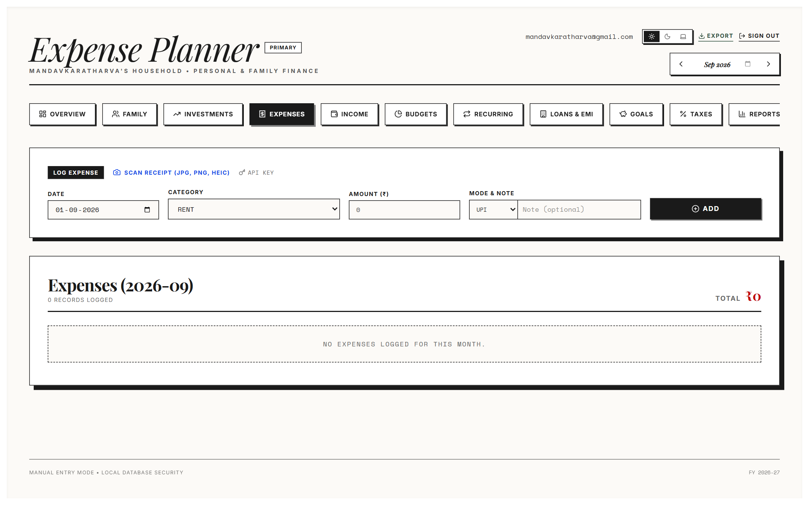 |  |
*Figure 1: Expense Planner's comprehensive dashboard interface*

## Problem Statement

Traditional financial management tools often suffer from several limitations:

1. **Manual Data Entry**: Users spend significant time manually entering transactions, leading to errors and inconsistent tracking
2. **Fragmented Solutions**: Separate apps for budgeting, expense tracking, investment monitoring, and tax planning create data silos
3. **Limited Collaboration**: Most tools are designed for individual use, lacking robust multi-user household support
4. **Manual Receipt Processing**: Physical receipts require manual entry, making expense categorization tedious and error-prone
5. **Deployment Complexity**: Financial applications often require complex setup, limiting accessibility for non-technical users

Expense Planner addresses these challenges through a unified platform that combines AI automation, collaborative features, and flexible deployment options.

### The Real Cost of Poor Financial Tooling

The consequences of fragmented financial management extend beyond mere inconvenience. Studies consistently show that households without consolidated visibility into their finances:

- **Overspend by 10-20%** in categories they never intended to exceed, simply because they lack real-time feedback
- **Miss tax deductions** worth thousands of rupees annually because expense documentation is scattered across email, paper receipts, and memory
- **Delay financial goals** like emergency funds and home down payments because progress is invisible and motivation fades
- **Experience relationship friction** when family members have different mental models of shared finances

The hidden cost is not just monetary — it is the cognitive load of maintaining multiple spreadsheets, remembering passwords for separate services, and manually reconciling discrepancies at month-end. Every hour spent on financial administration is an hour not spent on financial strategy.

### What a Modern Solution Requires

Solving these problems demands more than bolting features onto a legacy architecture. A genuinely modern personal finance platform needs:

1. **Zero-friction data entry** — if logging an expense takes more than 10 seconds, users will not do it consistently
2. **A single source of truth** — one database, one dashboard, one answer to "where did the money go?"
3. **Collaboration as a first-class citizen** — not shared logins, but proper multi-user access with appropriate permissions
4. **Intelligence, not just storage** — the system should surface insights proactively, not wait to be queried
5. **User data sovereignty** — financial data is deeply personal; users should control where it lives

Expense Planner was designed around these five principles from day one.

## Core Features Overview

Expense Planner offers an extensive feature set designed to cover all aspects of personal and family financial management:

### AI-Powered Receipt Scanning
- Upload receipt images to automatically extract amount, date, merchant, and category
- Utilizes Google Gemini AI for accurate optical character recognition (OCR) and data extraction
- Supports multiple image formats (JPG, PNG, HEIC) with automatic HEIC-to-JPEG conversion
- Implements client-server fallback mechanism for maximum deployment flexibility

### Multi-User Household Support
- Create or join households with role-based permissions (primary, spouse, dependent)
- Real-time data synchronization across household members
- Role-based access control for different financial operations
- Secure invitation system for adding family members

### Comprehensive Financial Tracking Modules
- **Income Tracking**: Detailed breakdown including basic salary, HRA, allowances, bonuses, and deductions

| Light Mode | Dark Mode |
|------------|-----------|
| 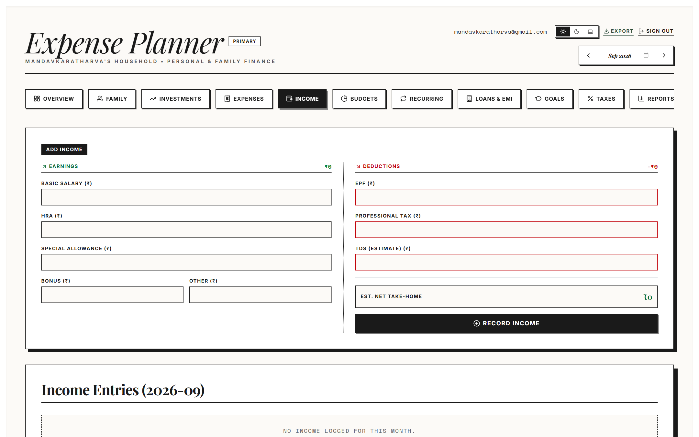 | 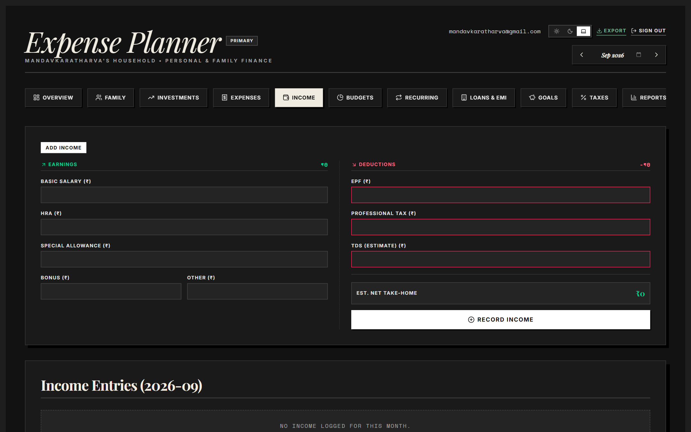 |
- **Expense Management**: Customizable categorization with payment mode tracking (UPI, Card, Cash, Netbanking)

| Light Mode | Dark Mode |
|------------|-----------|
|  | 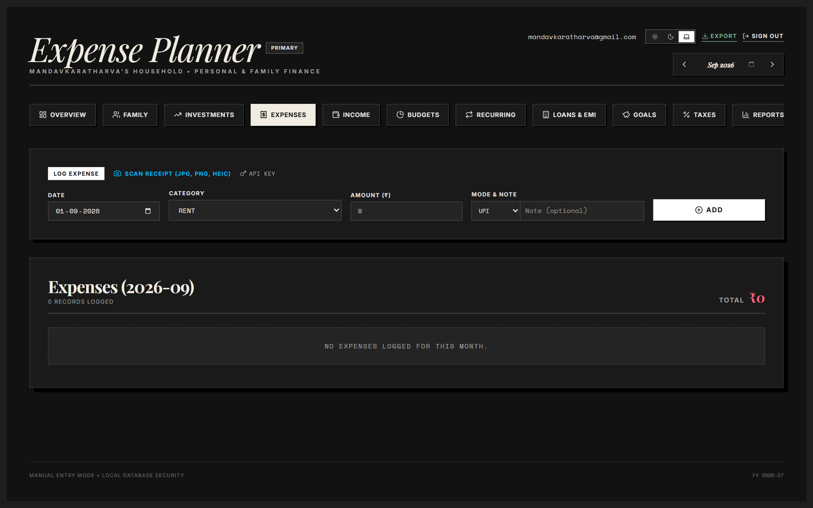 |
- **Budget Management**: Monthly limits per category with real-time spending alerts

| Light Mode | Dark Mode |
|------------|-----------|
| 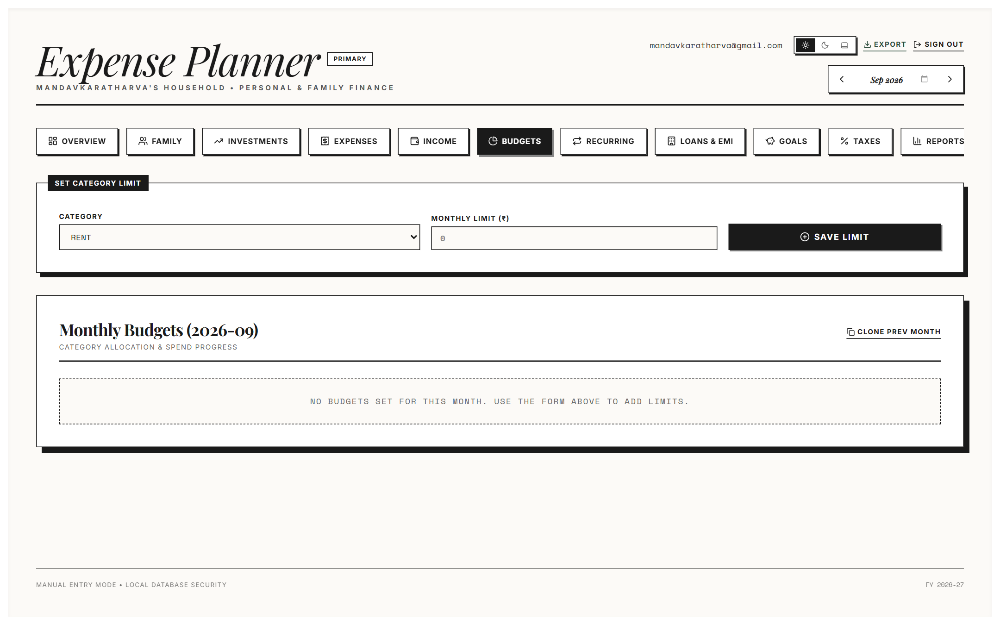 | 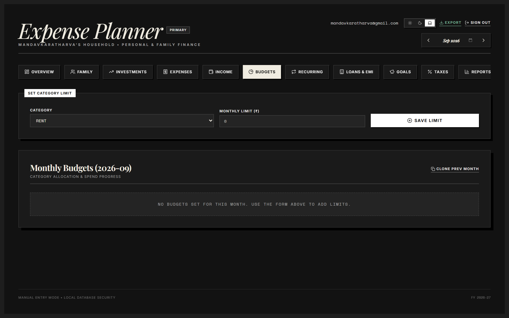 |
- **Loan & EMI Tracking**: Amortization schedules and outstanding balance monitoring

| Light Mode | Dark Mode |
|------------|-----------|
| 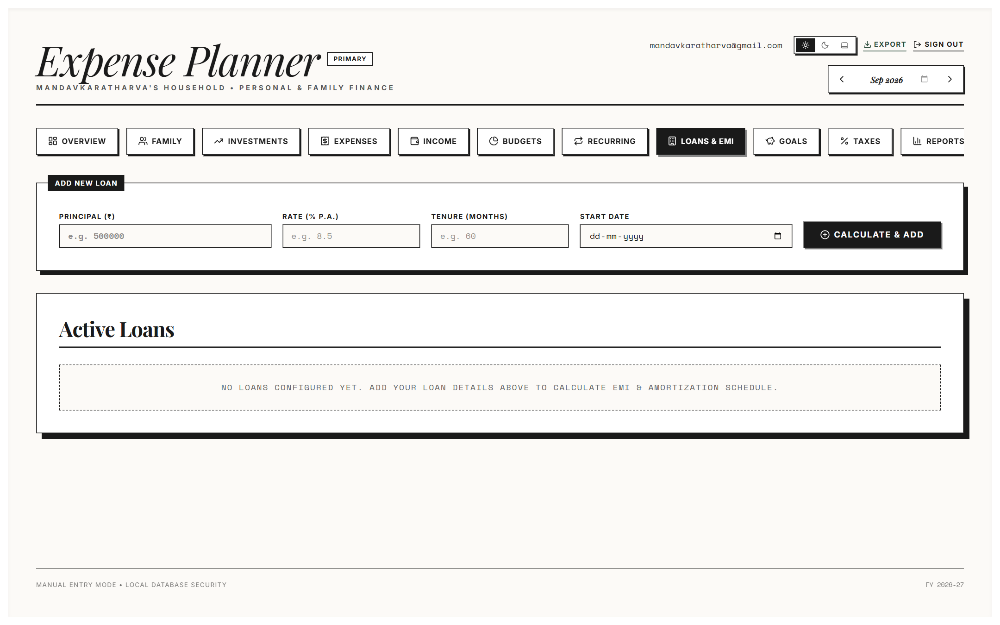 | 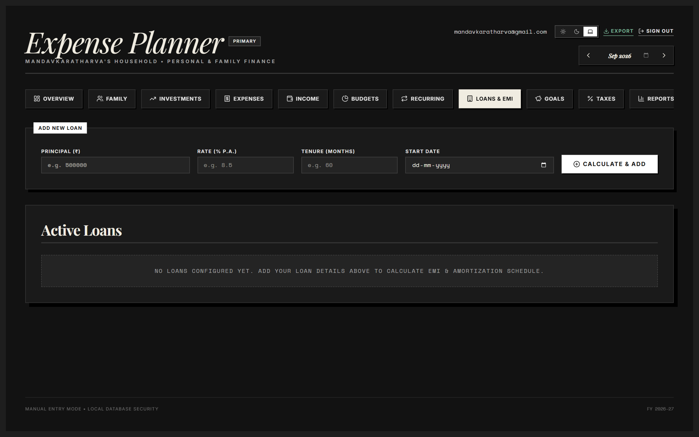 |
- **Investment Portfolio Tracking**: Mutual funds, stocks, fixed deposits, PPF, NPS, and gold investments

| Light Mode | Dark Mode |
|------------|-----------|
| 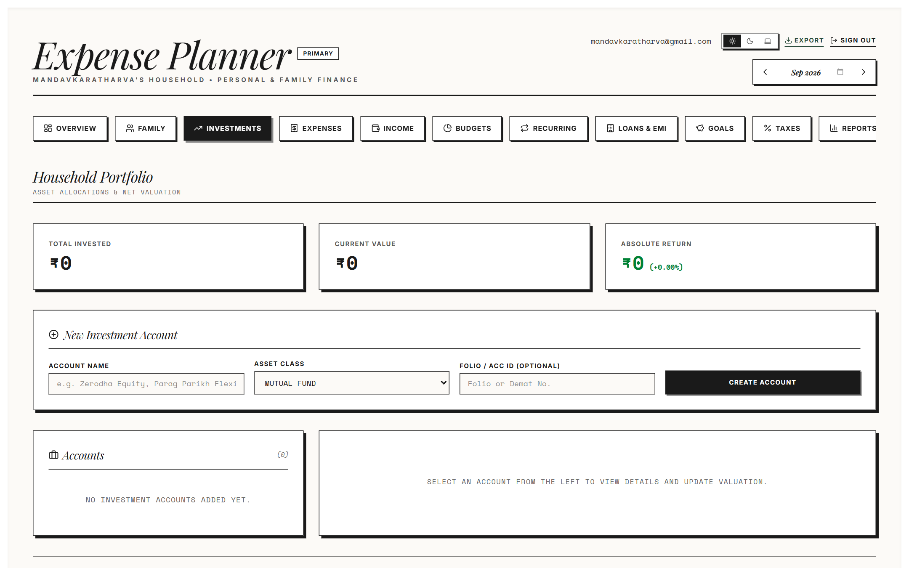 | 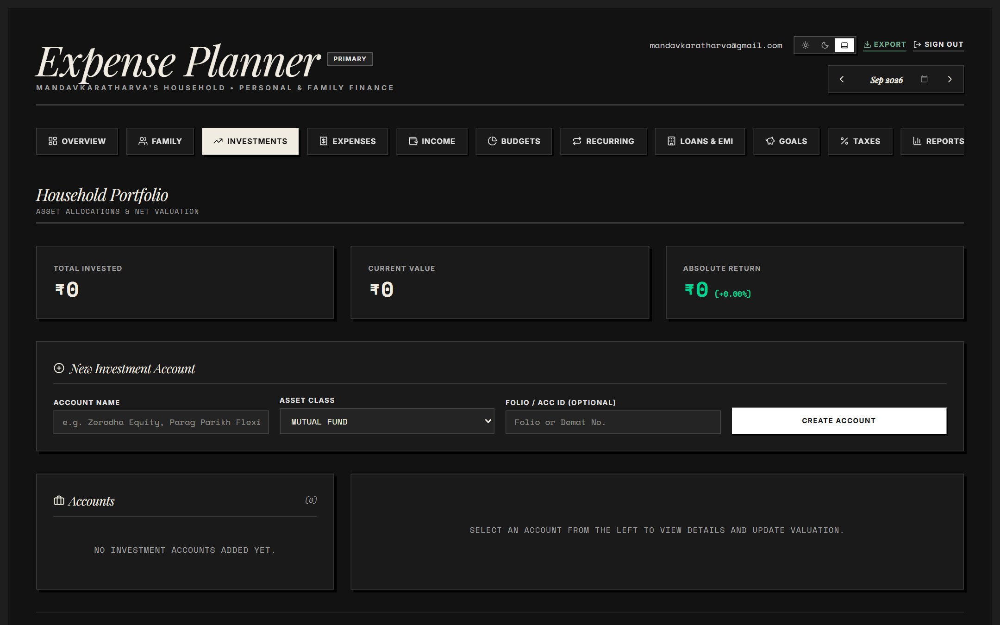 |
- **Savings Goals**: Target-based goal setting with progress tracking and linked recurring rules

| Light Mode | Dark Mode |
|------------|-----------|
| 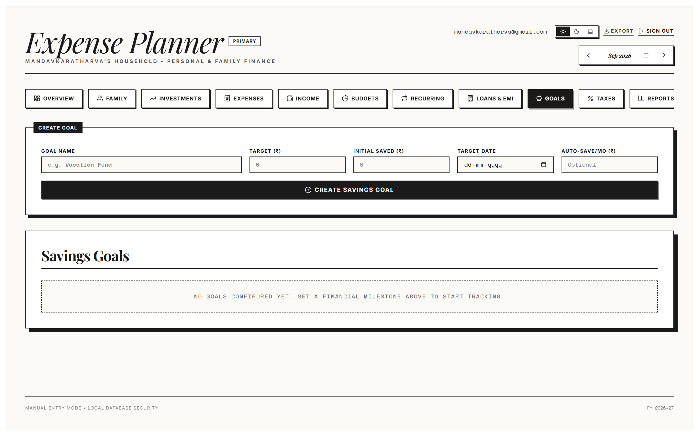 | 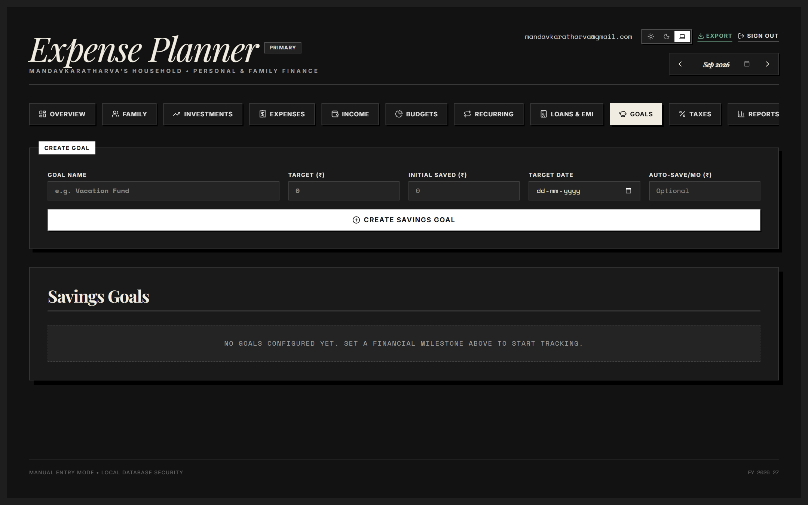 |
- **Tax Planning**: Old vs. new tax regime comparison with personalized recommendations

| Light Mode | Dark Mode |
|------------|-----------|
| 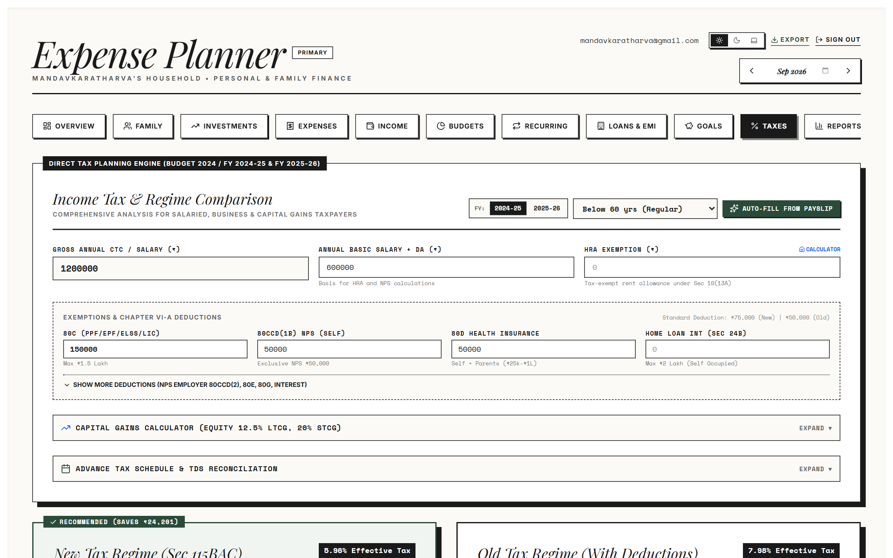 | 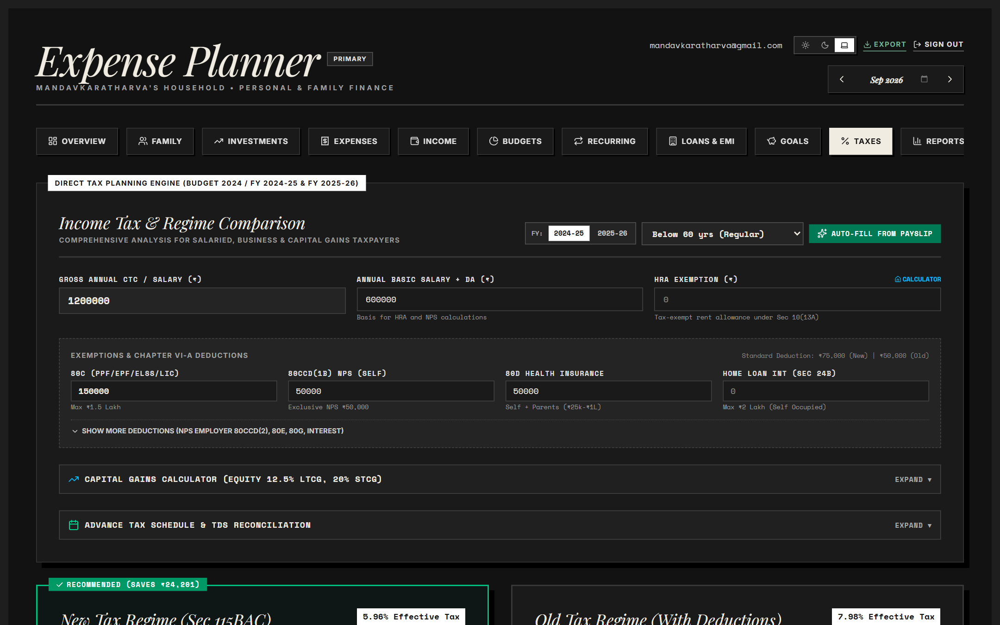 |

### Additional Capabilities
- **Recurring Transactions**: Automate regular expenses and incomes with flexible frequency options

| Light Mode | Dark Mode |
|------------|-----------|
| 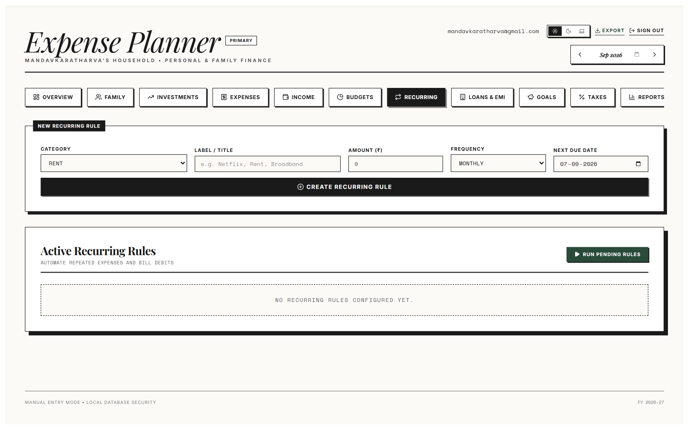 | 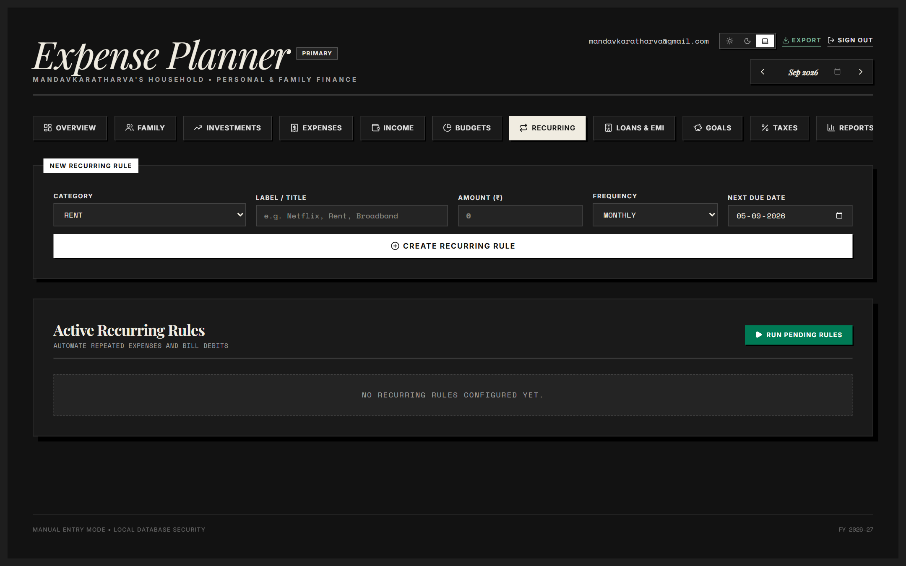 |
- **Data Export**: Generate financial reports in multiple formats
- **Responsive Design**: Mobile-friendly interface with adaptive layouts
- **Theme Support**: Light/dark mode with system preference detection
- **Offline Capabilities**: Firestore persistence for intermittent connectivity
- **Dual Deployment Options**: Run as traditional Express server or Vercel serverless functions

### Light and Dark Mode Support

Expense Planner provides seamless light and dark mode support, automatically adapting to the user's system preference while allowing manual toggling. The theme system is built using Tailwind CSS dark mode strategy, ensuring consistent styling across all components.

| Light Mode | Dark Mode |
|------------|-----------|
|  |  |
*Figure 2: Expense Planner dashboard in light and dark modes*

The theme context manages color schemes, ensuring that charts, forms, and navigation elements maintain readability and visual appeal in both modes.

## Getting Started: Your First 10 Minutes

One of Expense Planner's design goals is that a new user should reach a working, useful setup in under ten minutes. Here is what that journey looks like.

### Step 1: Sign Up (1 minute)

Registration uses email and password through Firebase Authentication. There is no lengthy onboarding questionnaire, no credit card requirement, and no trial period to track. Enter an email, choose a password, and you are in.

### Step 2: Your Household Is Created Automatically (0 minutes)

On first login, the application detects that you have no household membership and creates one for you automatically, designating you as the primary member. There is no separate "workspace setup" wizard — the sensible default is applied immediately, and you can rename the household later from the Household tab.

### Step 3: Log Your First Expense (2 minutes)

Navigate to the Expenses tab. You have two options:

- **Manual entry**: Type the amount, pick a category, choose the payment mode, done. The form is optimized for speed — sensible defaults are pre-selected, and the category list remembers your most-used categories.
- **Receipt scan**: Click the scan button, photograph or upload a receipt, and watch as Gemini AI extracts the amount, date, merchant, and suggested category. Review the extracted values, correct anything the AI got wrong, and save. The entire flow typically takes under 30 seconds.

### Step 4: Set a Budget (2 minutes)

Open the Budgets tab and set a monthly limit for one or two categories — Food and Transport are good starting points. The moment you save, the budget tracker begins watching your spending in that category. The progress bar on the dashboard updates in real time as you log expenses.

### Step 5: Invite Your Partner (2 minutes)

From the Household tab, generate an invite code for your partner's email address. Share the code however you like — WhatsApp, SMS, email. They sign up, enter the code, and instantly see the same financial picture you do. Every expense either of you logs appears in both views.

### Step 6: Explore (3 minutes)

Spend the remaining time exploring:

- The **Overview** tab for your consolidated financial picture
- The **Reports** tab for charts breaking down spending by category and payment mode
- The **Goals** tab to set a savings target — say, an emergency fund — and watch the projected completion date appear
- The **Taxes** tab to see how the old and new tax regimes compare for your income level

By the end of these ten minutes, you have a live budget, at least one tracked expense, a collaborating household member, and visibility into your financial trajectory. Compare this with the typical onboarding for traditional finance software, which can stretch to hours of category configuration and account linking.

## System Architecture

Expense Planner follows a well-designed three-tier architecture that ensures scalability, maintainability, and flexibility across different deployment environments. This architectural decision was made early in the project lifecycle to support the application's core requirements: real-time collaboration, offline capability, AI-powered features, and deployment flexibility.

### High-Level Architecture

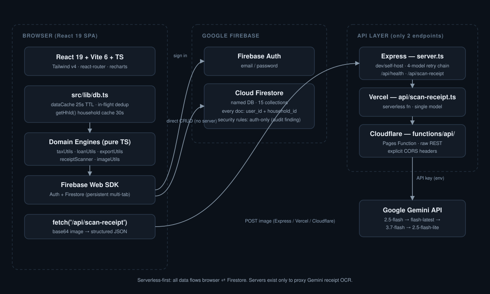
*Figure 3: Expense Planner's three-tier architecture with dual deployment options*

The application consists of four primary layers, each with clearly defined responsibilities:

#### 1. Client Layer
The client layer is a React/Vite single-page application responsible for:
- **UI Rendering**: Building responsive interfaces using React 19 and Tailwind CSS 4
- **State Management**: Managing application state through React Context (Auth, Theme) and local component state
- **User Interactions**: Handling form submissions, navigation, and real-time updates
- **Offline Capabilities**: Implementing optimistic UI updates and local caching for intermittent connectivity
- **Theme Adaptation**: Automatically switching between light and dark modes based on system preferences

#### 2. API Layer
The API layer handles business logic, data validation, and integration with external services through two deployment paths:
- **Express Server**: For local development, Docker deployments, and environments requiring full server control
- **Vercel Serverless Function**: For managed, scalable deployments with automatic scaling (`api/scan-receipt.ts` specifically handles AI receipt processing)

Both paths share the same business logic implementation, ensuring feature parity regardless of deployment target.

#### 3. Data Layer
Firebase Firestore serves as the primary data store, chosen for its:
- **Real-time Capabilities**: Enabling instantaneous synchronization across household members
- **Offline Persistence**: Allowing continued operation during network interruptions
- **Automatic Scaling**: Handling varying loads without manual intervention
- **Built-in Security**: Providing robust rules-based access control at the database level
- **Document Model Flexibility**: Accommodating the hierarchical, sparse nature of financial data

The application implements an intelligent caching layer on top of Firestore to reduce reads and improve response times for frequently accessed data.

#### 4. External Services
Expense Planner integrates with specialized external services for optimal functionality:
- **Google Gemini AI**: Powers the receipt scanning feature with state-of-the-art OCR and contextual understanding
- **Firebase Authentication**: Provides secure, scalable user management with email/password and social login options

### Communication Patterns

The layers communicate through well-defined interfaces:

- **Client ↔ API**: RESTful JSON over HTTPS with standardized request/response formats
- **API ↔ Firestore**: Direct database access via Firebase Admin SDK for optimal performance
- **API ↔ Gemini**: HTTP POST requests to `generativelanguage.googleapis.com` with exponential backoff retry logic
- **Client ↔ Gemini (fallback)**: Direct API calls from the client when a Gemini API key is stored in LocalStorage, providing an alternative path for environments where serverless functions aren't available

### Architectural Benefits

This architecture delivers several key advantages:

**Deployment Flexibility**  
The clean separation between client and API layers allows the same frontend to work with either the Express server or Vercel serverless functions, giving users the choice between self-hosted control and managed infrastructure.

**Scalability**  
Each layer can scale independently: the client layer scales with CDN distribution, the API layer scales through either traditional load balancing (Express) or automatic function scaling (Vercel), and the data layer scales through Firebase's managed infrastructure.

**Maintainability**  
With clearly defined responsibilities and interfaces, development teams can work on different layers simultaneously with minimal merge conflicts. Changes to one layer (such as updating the UI framework) don't require modifications to others as long as interfaces remain stable.

**Resilience**  
The dual-path AI processing (client-side and server-side fallbacks) ensures that critical features like receipt scanning remain available even if one path experiences issues. Similarly, the offline capabilities in the client layer allow continued use during network outages.

**Security**  
Security concerns are addressed at the appropriate layer: network security at the infrastructure level, authentication at the API layer, and data access control at the database level through Firestore security rules.

## Frontend Architecture

Built with modern web technologies, the frontend delivers a responsive, intuitive user experience across desktop browsers, tablets, and mobile devices. The architecture prioritizes fast initial loads, smooth interactions, and resilience against intermittent connectivity — all essential for a financial tool that users consult in varied contexts, from a desktop at home to a phone in a store checkout line.

### Technology Stack

- **React 19**: UI library for building interactive components. Concurrent rendering features keep the interface responsive even when rendering complex dashboards with multiple charts.
- **Vite 6**: Build tool and development server providing near-instant hot module replacement during development and optimized production bundles with aggressive code splitting.
- **React Router DOM 7**: Client-side routing for SPA navigation, enabling deep-linkable URLs for each financial section (e.g., `/budgets`, `/reports`) so users can bookmark specific views.
- **Tailwind CSS 4**: Utility-first CSS framework for styling, enabling rapid iteration on visual design while keeping the CSS payload minimal through automatic purging of unused styles.
- **Headless UI**: Accessible UI components (via Heroicons/lucide-react) providing keyboard navigation and screen-reader support out of the box.
- **Firebase JavaScript SDK**: Auth and Firestore integration with built-in offline persistence, allowing the app to remain functional during network interruptions and synchronize changes when connectivity returns.
- **Lucide React**: Beautifully designed icon set with tree-shakeable imports, ensuring only used icons contribute to bundle size.
- **Recharts**: Charting library for data visualization, powering the spending trend lines, category breakdown pie charts, and budget utilization gauges.
- **JSPdf**: PDF generation for reports, enabling client-side export of financial summaries without a server round-trip.
- **Heic2any**: HEIC image format conversion for iOS photos, ensuring receipt photos taken on iPhones work seamlessly with the scanning pipeline.

### Component Organization

The codebase follows a feature-based folder structure rather than a type-based one. Instead of separating all components, hooks, and utilities into top-level directories, related code is co-located by feature:

```
src/
├── components/
│   ├── dashboard/      # Overview widgets, summary cards
│   ├── expenses/       # ExpenseSection, ExpenseForm, ExpenseList
│   ├── income/         # IncomeSection, IncomeForm
│   ├── budgets/        # BudgetSection, BudgetCard, BudgetAlert
│   ├── loans/          # LoanSection, AmortizationTable
│   ├── investments/    # PortfolioView, HoldingRow
│   ├── goals/          # GoalCard, ProgressRing
│   ├── taxes/          # TaxComparison, RegimeCard
│   ├── household/      # MemberList, InviteForm
│   └── reports/        # ReportBuilder, ChartWrappers
├── contexts/           # AuthContext, ThemeContext
├── lib/                # firebase.ts, cache.ts, receiptScanner.ts
├── hooks/              # useHousehold, useBudgets, useTransactions
└── utils/              # formatters, validators, date helpers
```

This structure pays dividends as the application grows: a developer working on the budgets feature finds everything related to budgets in one place, and removing a feature is as simple as deleting a directory.

### State Management Approach

Expense Planner employs a context-based state management strategy:

- **AuthContext**: Manages Firebase user state, household membership, and loading states. Subscribing components re-render only when auth-relevant fields change, avoiding cascade renders on unrelated updates.
- **ThemeContext**: Handles light/dark mode preferences with system detection. The preference persists to localStorage and applies the `dark` class to the document root, letting Tailwind's `dark:` variants handle the rest.
- **Custom Caching Layer**: Implements a 25-second TTL memory cache for frequently accessed data. Write operations invalidate affected cache keys immediately, so users never see stale data after making a change — the cache trades a small amount of freshness for a large reduction in Firestore reads (and therefore cost).
- **Local State**: Component-level state for form inputs and UI flags. Form state stays local to avoid polluting global state with ephemeral values like "is the dropdown open."

The deliberate avoidance of a global store (Redux, Zustand) keeps the mental model simple: server data lives in Firestore and the cache, session data lives in contexts, and UI data lives in components. Three places, each with a single responsibility.

### Key Frontend Components

| Light Mode | Dark Mode |
|------------|-----------|
| 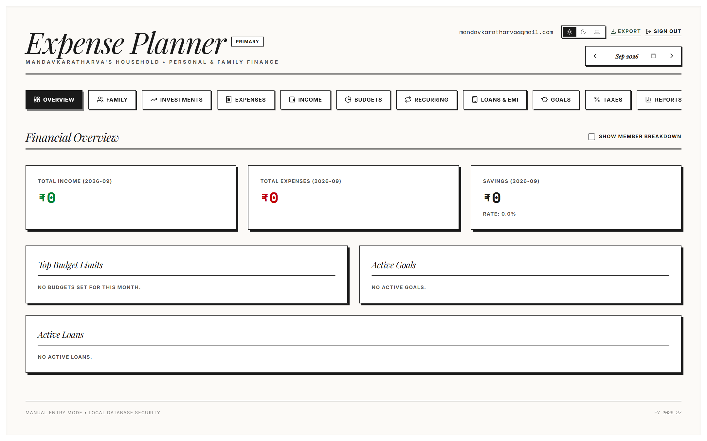 | 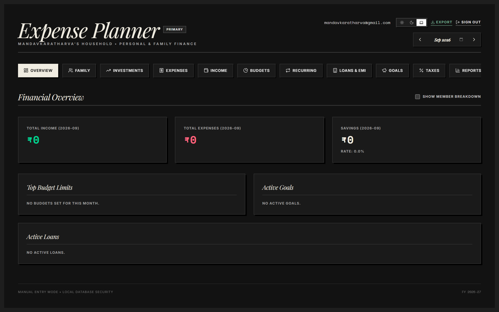 |
*Figure 4: Dashboard overview showing financial summary*

1. **ExpenseSection**: Primary interface for logging expenses with AI receipt scanning capabilities
2. **IncomeSection**: Detailed income tracking with breakdown components
3. **BudgetSection**: Budget creation, monitoring, and alert system
4. **DashboardLayout**: Tabbed navigation providing quick access to all financial sections
5. **ReceiptScanner**: Library handling client-server fallback for Gemini AI integration
6. **ProtectedRoute**: Ensures only authenticated users can access application features

| Light Mode | Dark Mode |
|------------|-----------|
|  |  |
*Figure 5: Expense entry form with AI receipt scanning functionality*

## Backend Architecture

The backend provides robust business logic, data validation, and seamless integration with Firebase services. Designed with a "thin API, rich client" philosophy, the backend focuses on security-sensitive operations, rate limiting, and orchestrating calls to external services while leaving data management primarily to Firebase's client SDK for real-time synchronization.

### Technology Stack

- **Node.js**: JavaScript runtime environment providing the execution environment for the Express server and serverless functions. Its non-blocking I/O model suits the API's I/O-bound workload (database calls, external API calls) far better than CPU-bound computation.
- **Express 4**: Battle-tested web framework for the API server, chosen for its minimalism, vast middleware ecosystem, and predictable behavior under load.
- **Firebase Admin SDK**: Server-side Firestore access and authentication verification, bypassing client security rules for trusted operations like invitation validation and household management.
- **Google Generative AI (@google/genai)**: Gemini AI integration for receipt scanning, with the client library handling retries, timeouts, and response parsing.
- **Express Rate Limit**: Request throttling for abuse prevention, protecting both the application budget (AI API calls cost money) and downstream services.
- **Dotenv**: Environment variable loading, keeping secrets out of source control while enabling straightforward configuration across development, staging, and production environments.
- **TSX**: TypeScript execution for development, providing fast startup times with on-the-fly transpilation — no separate compile step during the development loop.
- **ESBuild**: Bundling for the production server, producing a single `dist/server.cjs` file in milliseconds rather than the seconds required by webpack-based alternatives.
- **Vercel**: Serverless functions platform hosting `api/scan-receipt.ts` for zero-infrastructure deployments.

### API Design Philosophy

The backend follows several guiding principles:

**Minimal Surface Area**  
Only operations requiring elevated privileges or external service orchestration pass through the custom API. Routine CRUD operations flow directly from the client to Firestore, secured by Firestore Security Rules. This minimizes the custom code surface that requires security audits and maintenance.

**Defense in Depth**  
Even though Firestore rules enforce data access at the database layer, the API performs its own authentication verification and input validation. This redundancy means a misconfiguration in one layer doesn't immediately expose data.

**Idempotent Operations**  
Wherever possible, API operations are designed to be safely retryable. Receipt scanning, for example, produces the same result whether called once or retried after a network timeout, preventing duplicate processing from client retries.

**Fail Securely**  
Errors are categorized into client errors (4xx — invalid input, authentication failure), server errors (5xx — unexpected conditions), and external service errors (AI API failures). Each category returns appropriately sanitized responses: detailed enough for debugging client issues, vague enough to avoid leaking internals.

### Request Processing Flow

#### Express Server Request Flow
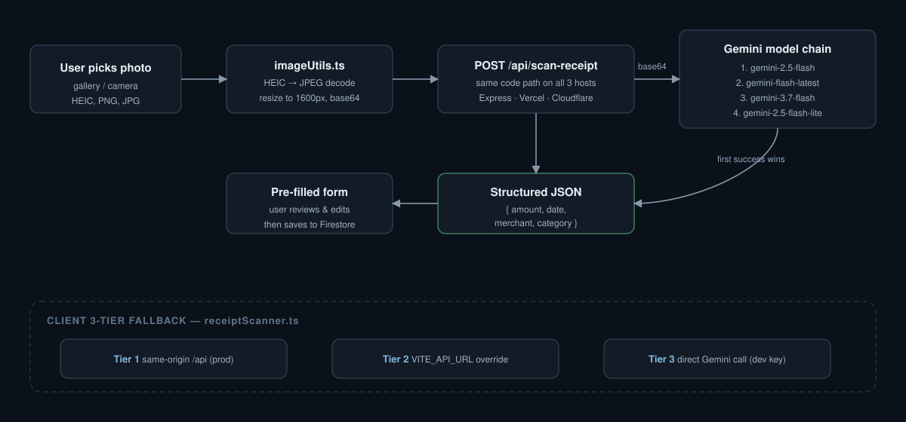
*Figure 6: Request flow for Express server deployment*

1. **Client sends HTTPS request** to API endpoint with Authorization header containing Firebase ID token
2. **Middleware chain execution**:
   - Rate limiter checks request count against per-IP thresholds
   - JSON parser validates and parses the request body (25MB limit)
   - Authentication middleware verifies the Firebase ID token via Admin SDK
3. **Route handler execution**: For receipt scanning, the handler validates image format and size, then calls the Gemini AI API with structured output instructions
4. **Data persistence**: Successful operations interact with Firestore via Firebase Admin SDK with full admin privileges
5. **Response formatting**: JSON response with appropriate HTTP status code returns to client; errors flow through the centralized error handler for consistent formatting

#### Vercel Serverless Function Flow
The Vercel function follows a similar logical pattern but operates within serverless constraints:
- **Cold start optimization**: Module-level code (imports, SDK initialization) executes once per container instance, with per-request work kept minimal
- **Automatic scaling**: New instances spawn under load without configuration, and idle instances terminate to reduce cost
- **Built-in body parsing**: 10MB limit for JSON payloads, appropriate for base64-encoded receipt images
- **Stateless execution**: No reliance on in-memory state between invocations; all state lives in Firestore
- **Edge optimization**: Functions deploy to regions close to users, minimizing latency for the geographically distributed user base

### Core Backend Modules

1. **server.ts**: Main entry point containing route definitions, middleware registration, and server startup logic. Organized as a composition root — it wires dependencies together but contains no business logic itself.

2. **api/scan-receipt.ts**: The Vercel serverless function for AI receipt scanning. Deliberately self-contained so it can deploy independently of the Express server, sharing only the receipt-processing logic module.

3. **Firebase Integration**: Initialized in `src/lib/firebase.ts` with fallback configuration. The module detects its environment (development, Docker, Vercel) and sources credentials appropriately — service account JSON in production, emulators in local development.

4. **Receipt Scanning Logic**: Google Gemini AI integration with multiple model fallbacks (`gemini-2.0-flash`, then `gemini-1.5-flash` if the primary is unavailable). The prompt engineering instructs the model to return strictly structured JSON, and a parser validates the response shape before it reaches the client — malformed AI responses become clean "extraction failed" errors rather than corrupted data.

5. **Error Handling**: Centralized error logging with Firestore operation tracking. Every database operation logs its collection, operation type, and duration, creating an audit trail invaluable for debugging production issues and identifying slow queries.

## Database Architecture

Expense Planner leverages Firebase Firestore's flexible NoSQL document database model, optimized for financial data access patterns. The schema design balances normalization (to avoid data duplication) with denormalization (to minimize read operations), a deliberate trade-off driven by Firestore's pricing model where document reads dominate cost. This approach ensures efficient querying while maintaining data integrity and minimizing operational expenses.

### Entity Relationship Diagram

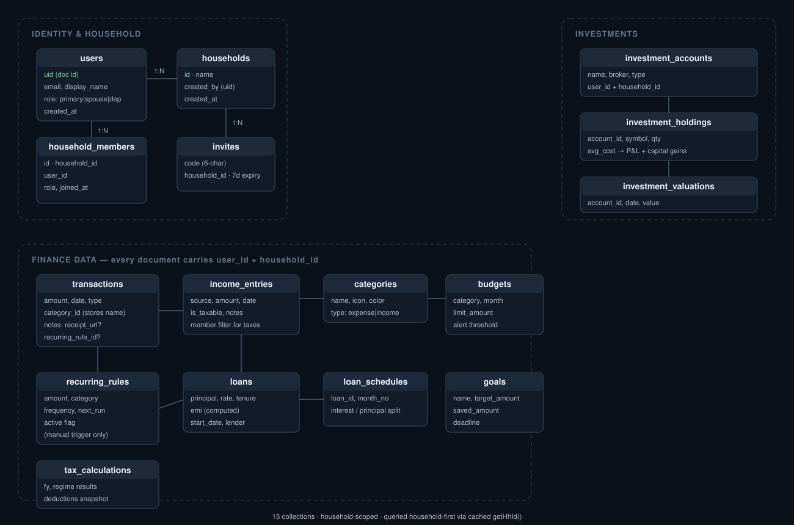
*Figure 7: Entity relationship diagram showing data model relationships*

### Collections Structure

The application utilizes multiple interconnected collections, each designed with specific access patterns and data relationships in mind:

#### Core Collections

**households**  
Top-level container for financial data. Each document stores:
- `name`: Household name (e.g., "Smith Family")
- `creator_uid`: UID of the user who created the household
- `created_at`: Timestamp of household creation
- `settings`: Nested object for household-wide preferences (currency, date format, etc.)

**household_members**  
Junction table implementing many-to-many relationship between users and households with role-based access control:
- `uid`: User ID (foreign key to Firebase Auth users)
- `household_id`: Household ID (foreign key to households collection)
- `role`: Enumerated role (primary, spouse, dependent) determining permissions
- `joined_at`: Timestamp when user joined the household
- `is_active`: Boolean flag for soft deletion (preserves history when members leave)

**transactions**  
The workhorse collection storing every financial movement:
- `amount`: Transaction value (negative for expenses, positive for income)
- `date`: Transaction date (stored as Firestore Timestamp for timezone safety)
- `merchant`: Payee/payer name (store, employer, person, etc.)
- `category`: Reference to categories collection (enables consistent reporting)
- `payment_mode`: Enumerated type (UPI, Card, Cash, Netbanking, etc.)
- `description`: Optional free-text memo field
- `receipt_url`: Link to scanned receipt image (if applicable)
- `user_id`: Owner user ID (for personal transactions outside households)
- `household_id`: Household ID (null for personal transactions)
- `created_at`: Server timestamp for audit trail
- `tags`: Array field for user-defined labels (e.g., "tax-deductible", "reimbursable")

**income_entries**  
Detailed income tracking that complements the transactions collection:
- `gross_amount`: Total income before deductions
- `net_amount`: Take-home pay after deductions
- `breakdown`: Nested object with salary components (basic, HRA, allowances, bonuses)
- `deductions`: Array of deduction objects (tax, insurance, retirement contributions)
- `pay_period`: Enumerated type (weekly, biweekly, monthly)
- `employer_name`: Source of income
- `date`: Income receipt date
- `user_id`: Owner user ID
- `household_id`: Associated household (if applicable)

**budgets**  
Monthly spending guardrails with proactive alerts:
- `category`: Reference to categories collection
- `amount`: Monthly spending limit
- `period_start`: First day of budget month
- `period_end`: Last day of budget month
- `alert_threshold`: Percentage triggering warning (default 80%)
- `alert_enabled`: Boolean toggle for notifications
- `rollover_enabled`: Boolean controlling whether unused funds carry forward
- `user_id`: Owner user ID
- `household_id`: Associated household

**recurring_rules**  
Template engine for automated transaction creation:
- `template`: Partial transaction object (amount, category, description, etc.)
- `frequency`: Enumerated type (daily, weekly, monthly, yearly, custom)
- `interval`: Integer multiplier for frequency (e.g., every 2 weeks)
- `next_due_date`: Calculated date for next occurrence
- `end_date`: Optional termination date
- `user_id`: Owner user ID
- `household_id`: Associated household
- `auto_create`: Boolean controlling whether transactions are created automatically or require approval

**loans** & **loan_schedules**  
Two-collection pattern for efficient loan tracking:
- **loans**: Principal loan metadata
  - `principal_amount`: Original loan amount
  - `interest_rate`: Annual percentage rate (APR)
  - `tenure_months`: Total loan duration
  - `start_date`: Loan disbursement date
  - `loan_type`: Enumerated type (home, auto, personal, education, etc.)
  - `user_id`: Owner user ID
  - `household_id`: Associated household
- **loan_schedules**: Individual payment records (one document per EMI)
  - `loan_id`: Reference to parent loan
  - `payment_number`: Sequential payment number
  - `due_date`: Scheduled payment date
  - `paid_date`: Actual payment date (null if pending)
  - `opening_balance`: Principal at start of period
  - `emi_amount`: Total monthly payment
  - `principal_component`: Portion reducing loan principal
  - `interest_component`: Portion covering interest expense
  - `closing_balance`: Principal remaining after payment
  - `status`: Enumerated type (pending, paid, late, missed)

**goals**  
Target-based savings motivation:
- `name`: Goal description (e.g., "Emergency Fund", "Vacation to Hawaii")
- `target_amount`: Desired savings amount
- `current_amount`: Progress toward target
- `target_date`: Desired completion date
- `current_date`: Calculation date for progress
- `monthly_contribution`: Planned regular savings amount
- `auto_fund`: Boolean linking to recurring_rules for automatic transfers
- `user_id`: Owner user ID
- `household_id`: Associated household

**tax_calculations**  
Year-round tax planning assistance:
- `assessment_year`: Financial year for calculation (e.g., "2025-26")
- `gross_income`: Total income from all sources
- `deductions`: Itemized deduction amounts by section (80C, 80D, etc.)
- `taxable_income`: Income after deductions
- `old_regime_tax`: Tax liability under old regime
- `new_regime_tax`: Tax liability under new regime
- `refund_or_payable`: Net amount (negative = refund due, positive = tax payable)
- `user_id`: Owner user ID
- `household_id`: Associated household

#### Reference Data

**categories**  
Hierarchical expense/income classification system:
- `name`: Category name (e.g., "Food & Dining", "Salary")
- `type`: Enumerated type (expense or income)
- `parent_id`: Reference to parent category (null for top-level)
- `icon`: Suggested icon identifier for UI display
- `color`: Suggested color for charts and indicators
- `is_default`: Boolean distinguishing system-provided from user-created
- `sort_order`: Integer for consistent display ordering

**investment_accounts** & **investment_holdings** & **investment_valuations**  
Three-collection pattern for investment portfolio tracking:
- **investment_accounts**: Investment vehicles and platforms
  - `name`: Account name (e.g., "SBI Mutual Fund", "Zerodha Demat")
  - `type`: Enumerated type (mutual_fund, stock, fd, ppf, nps, gold, etc.)
  - `provider`: Institution name
  - `account_number`: Obfuscated identifier for reference
  - `user_id`: Owner user ID
  - `household_id`: Associated household
- **investment_holdings**: Individual securities within accounts
  - `account_id`: Reference to parent investment account
  - `symbol`: Ticker or fund code
  - `quantity`: Number of units/shares held
  - `average_cost`: Weighted average purchase price
  - `current_value`: Market value based on latest valuation
  - `user_id`: Owner user ID
  - `household_id`: Associated household
- **investment_valuations**: Time-series market data
  - `holding_id`: Reference to parent investment holding
  - `date`: Valuation date
  - `price_per_unit`: Market price on valuation date
  - `total_value`: Calculated holding value (quantity × price_per_unit)
  - `user_id`: Owner user ID
  - `household_id`: Associated household

### Indexing Strategy

Firestore's automatic indexing, combined with thoughtful query design, minimizes manual index management while ensuring query performance:

#### Automatic Index Utilization

The application leverages Firestore's automatic index creation for:
- **Single-field indexes**: Queries filtering on one field (e.g., `where("category", "==", "food")`)
- **Range queries**: Inequality filters on timestamps or numbers (e.g., `where("date", ">=", startDate)`)
- **Equality + ordering**: Equality filters combined with ordering (e.g., `where("household_id", "==", householdId).orderBy("date", "desc")`)

#### Compound Query Optimization

For complex multi-filter scenarios, the application structures queries to work with Firestore's compound indexes:
- **Transaction listings**: `where("household_id", "==", hhId).where("date", ">=", start).where("date", "<=", end).orderBy("date", "desc")`
- **Budget vs actual**: `where("category", "==", catId).where("date", ">=", monthStart).where("date", "<=", monthEnd)`
- **Goal progress**: `where("user_id", "==", uid).where("target_date", ">=", today)`

#### Denormalization for Read Efficiency

Where query patterns indicate frequent access to related data, strategic denormalization reduces read operations:
- **Transaction records** include merchant name and category name alongside IDs, eliminating joins for display
- **User profiles** cache household names and roles to avoid household_members lookups in UI headers
- **Loan schedules** store calculated opening/closing balances to avoid recomputing amortization on each read

#### Index Monitoring and Maintenance

While Firestore handles automatic index creation, the application monitors query patterns through:
- **Development logging**: Flagging queries that might benefit from composite indexes
- **Production metrics**: Tracking read operation counts per collection
- **Periodic review**: Evaluating whether manual composite indexes would reduce cost for high-volume queries

This approach ensures optimal performance without the maintenance burden of managing hundreds of manual indexes, while still providing escape hatches for query optimization when necessary.

## Key Feature Deep Dive

### AI-Powered Receipt Scanning Workflow


*Figure 8: Detailed receipt scanning workflow with client-server fallback*

The receipt scanning feature represents one of Expense Planner's most innovative capabilities:

1. **Image Acquisition**: User selects or captures receipt image (JPG, PNG, HEIC supported)
2. **Preprocessing**: 
   - HEIC images automatically converted to JPEG format
   - Optional client-side resizing for oversized images
   - Base64 encoding for API transmission
3. **Dual-Path Processing**:
   - **Client-Side Path**: If Gemini API key available in LocalStorage, direct API call to Gemini
   - **Server-Side Path**: Request sent to `/api/scan-receipt` endpoint (Express or Vercel)
4. **AI Processing**:
   - Google Gemini API analyzes image for text extraction
   - Multiple model fallbacks ensure reliability
   - Structured output parsing for amount, date, merchant, and category
5. **Result Handling**:
   - Extracted data populates form fields for user review
   - User validates and confirms extracted information
   - On submit: Transaction saved to Firestore transactions collection
   - UI updates in real-time to reflect new expense

### Household Collaboration System

| Light Mode | Dark Mode |
|------------|-----------|
| 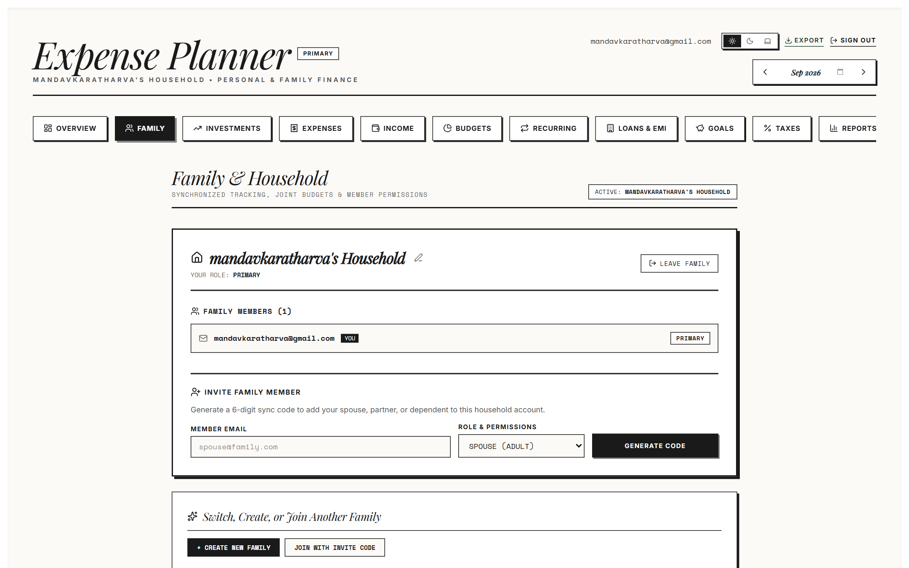 | 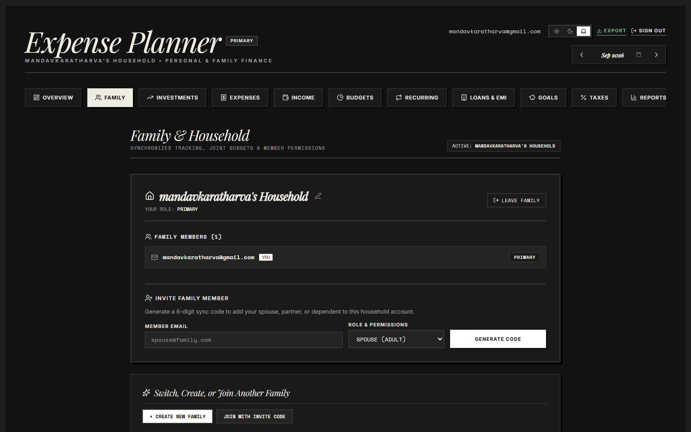 |
*Figure 9: Household management interface in light and dark modes*

The multi-user household functionality enables seamless financial collaboration:

1. **Household Creation**: Primary user creates household upon first login (if no existing membership)
2. **Invitation System**:
   - Primary member generates secure invite code for specific email address
   - Invite includes expiration timestamp and role specification (spouse/dependent)
   - Code shared via preferred communication channel
3. **Acceptance Flow**:
   - Invitee enters email and invite code in application
   - System validates code against pending invitations
   - Upon validation: Creates/updates household membership record
   - Invite marked as accepted to prevent reuse
4. **Role-Based Access Control**:
   - **Primary**: Full access to all household data and settings
   - **Spouse**: Nearly identical privileges to primary (may have restrictions on certain settings)
   - **Dependent**: Restricted access (typically cannot modify core settings or invite others)
   - UI dynamically adjusts visible tabs and functionality based on user role

### Financial Reporting and Analytics

| Light Mode | Dark Mode |
|------------|-----------|
| 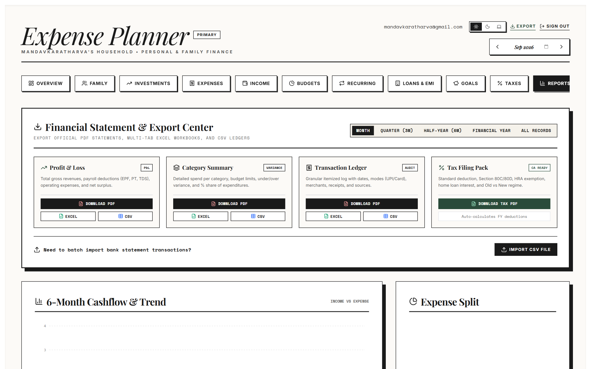 | 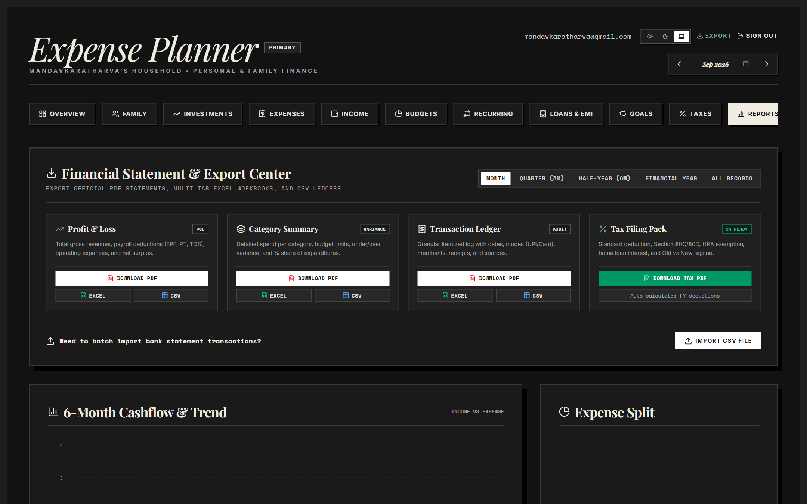 |
*Figure 10: Financial reports interface in light and dark modes*

Expense Planner provides comprehensive reporting capabilities across all financial domains:

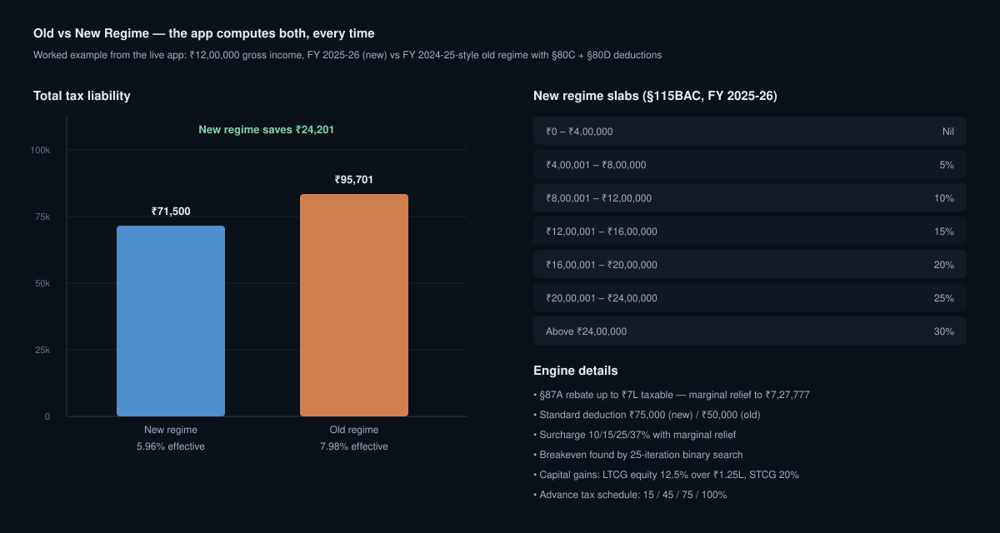
*Figure 11: Tax regime comparison visualization*

1. **Dashboard Overview**: 
   - Net worth calculation (assets minus liabilities)
   - Monthly income vs. expenses summary
   - Budget utilization percentages by category
   - Upcoming bills and recurring transactions
   - Investment portfolio performance snapshot

2. **Detailed Reports**:

| Light Mode | Dark Mode |
|------------|-----------|
| 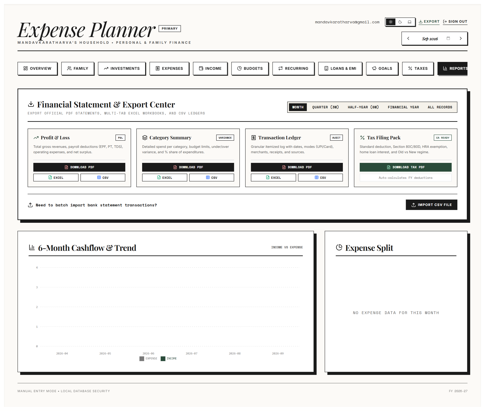 | 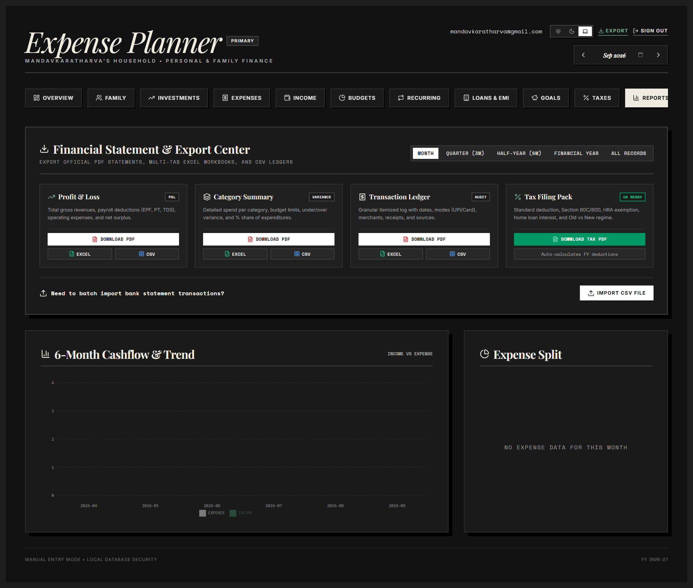 |
*Figure 12: Detailed financial reports in light and dark modes*

   - **Expense Reports**: Category-wise spending trends, monthly comparisons, payment method analysis
   - **Income Reports**: Source breakdown, growth trends, deduction analysis
   - **Investment Reports**: Portfolio allocation, performance benchmarks, dividend tracking
   - **Loan Reports**: Amortization schedules, interest paid vs. principal, early payment impact analysis
   - **Goal Tracking**: Progress visualization, projected completion dates, required monthly savings
   - **Tax Planning**: Side-by-side old vs. new regime comparison, deduction optimization suggestions

| Light Mode | Dark Mode |
|------------|-----------|
| 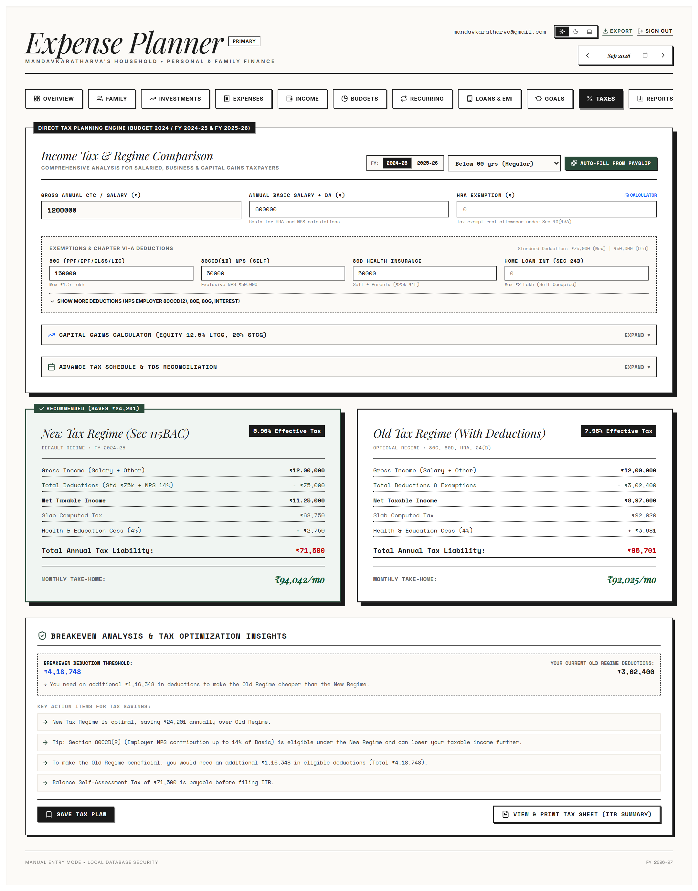 | 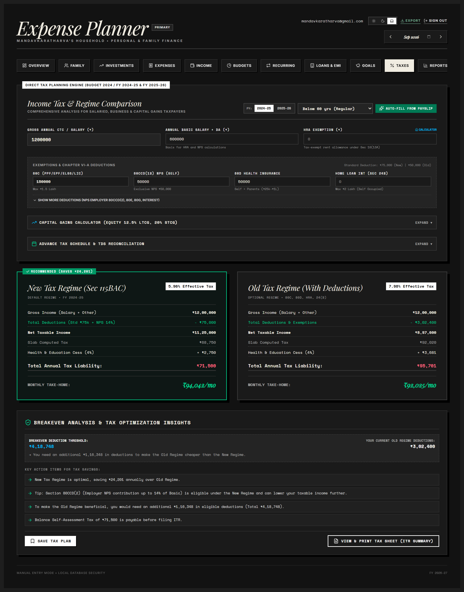 |
*Figure 13: Tax planning comparison in light and dark modes*

3. **Export Capabilities**:
   - PDF generation for comprehensive financial reports
   - CSV export for raw transaction data (compatible with spreadsheet applications)
   - Custom date range filtering for period-specific reporting

### Smart Notifications and Alerts

Expense Planner keeps users informed without being intrusive through a tiered notification system:

- **Budget Alerts**: When spending reaches 80% of a category limit, an in-app notification appears; at 100%, a push notification (if enabled) and email summary are sent.
- **Bill Due Reminders**: For recurring rules with auto-create disabled, reminders are sent 2 days before the due date.
- **Goal Milestones**: When a savings goal reaches 25%, 50%, 75%, and 100% completion, celebratory notifications appear.
- **Unusual Spending Detection**: Using simple statistical heuristics (e.g., amount > 3× average for that category), the system flags potential outliers for review.
- **Duplicate Transaction Detection**: If a receipt scan matches an existing transaction within the last 24 hours and same amount, a warning appears to prevent double-entry.

All notifications respect user preferences and can be silenced per category or globally.

## Deployment Options

Expense Planner offers flexible deployment strategies to accommodate different technical requirements and infrastructure preferences.

### Traditional Server Deployment (Docker/Node.js)

For users preferring full control over their infrastructure:

#### Docker Deployment
```bash
# Quick start with Docker Compose
docker compose up --build

# Manual Docker usage
docker build -t expense-planner .
docker run -d -p 3000:3000 --name expense-planner-app \
  -e GEMINI_API_KEY="your-key-here" \
  expense-planner
```

The Docker implementation uses a multi-stage build process:
- **Builder Stage**: Installs dependencies, builds frontend assets, bundles server code
- **Runner Stage**: Production-optimized image with only runtime dependencies
- **Result**: Approximately 150-200MB image size with enhanced security through non-root user execution

#### Traditional Node.js Deployment
```bash
# Setup and deployment
npm install --omit=dev
npm run build
NODE_ENV=production node dist/server.cjs
```

### Serverless Deployment (Vercel)

For users seeking managed infrastructure with automatic scaling:

#### GitHub Actions CI/CD Pipeline
The automated pipeline handles:
1. Linting and TypeScript checking
2. Unit testing (when implemented)
3. Production build generation
4. Security auditing (npm audit and Snyk scan)
5. Vercel preview deployment (for pull requests)
6. Vercel production deployment (for main branch pushes)
7. Docker image building and pushing to GHCR

#### Manual Vercel Deployment
```bash
# Install CLI and configure
npm install -g vercel
vercel link
vercel env add GEMINI_API_KEY
vercel --prod
```

### Hybrid Approach Benefits

The dual deployment strategy provides significant advantages:

1. **Deployment Flexibility**: Choose between serverful control or serverless convenience
2. **Environment Consistency**: Identical codebase runs identically across deployment targets
3. **Feature Parity**: All features (including receipt scanning) work identically in both modes
4. **Cost Optimization**: Serverless option reduces costs for sporadic usage; serverful option better for consistent traffic
5. **Technology Agnosticism**: Works with various hosting providers and infrastructure preferences

### Environment Variables and Configuration

Expense Planner uses environment variables for configuration, keeping secrets out of source code. Key variables include:
- `GEMINI_API_KEY`: For AI receipt scanning (optional if using client-side key)
- `FIREBASE_PROJECT_ID`, `FIREBASE_PRIVATE_KEY`, `FIREBASE_CLIENT_EMAIL`: For Firebase Admin SDK initialization
- `NODE_ENV`: Set to 'production' for production builds
- `PORT`: The port the Express server listens on (default 3000)

### Scaling and Performance

- **Serverless (Vercel)**: Automatically scales based on request volume; each function instance handles one request at a time but concurrency is managed by the platform.
- **Serverful (Docker/Node.js)**: Can be scaled horizontally behind a load balancer; state is stored in Firestore, so any number of instances can be added.
- **CDN**: Static assets are served via Vercel's CDN (for serverless) or can be offloaded to a CDN like Cloudflare or AWS CloudFront for Docker deployments.

### Monitoring and Logging

- **Error Tracking**: Integrates with services like Sentry or LogRocket via environment variables to capture production errors.
- **Performance Metrics**: Custom timers log API request durations, Firestore operation times, and AI processing latency.
- **Audit Logs**: Critical operations (invitation creation, role changes, data exports) are logged to a dedicated Firestore collection for compliance and debugging.

### Custom Domains and SSL

Both deployment options support custom domains with automatic SSL provisioning:
- Vercel provides built-in SSL for custom domains via Let's Encrypt.
- Docker deployments can use a reverse proxy like Nginx or Caddy to terminate SSL and forward to the Express server.

### Backup and Recovery

Since data resides in Firestore, backups can be taken via scheduled exports to Cloud Storage. Point-in-time recovery is possible through Firestore's import/export functionality.

## Security Architecture

Security is a foundational aspect of Expense Planner's design, implementing multiple layers of protection.

### Authentication and Authorization

| Light Mode | Dark Mode |
|------------|-----------|
|  | 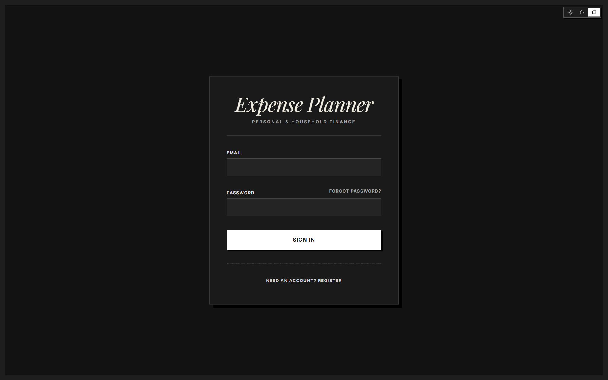 |
*Figure 14: Login screen in light and dark modes*

- **Firebase Authentication**: Industry-standard secure authentication with email/password provider
- **ID Token Verification**: Firebase Admin SDK validates tokens on each API request
- **Resource Ownership Model**: Data access controlled through `user_id` and `household_id` scoping
- **Role-Based Access Control**: Household member roles determine permissible operations
- **Protected Routes**: All routes except login require authentication validation

### Data Protection Measures

- **Firestore Security**: Automatic encryption at rest and in transit
- **Environment Variable Separation**: Secrets stored outside codebase
- **Input Validation**: Server-side validation for all API endpoints
- **Rate Limiting**: 
  - Global: 100 requests/15min/IP (Express server)
  - Receipt Scanning: 10 requests/hour/IP (protects expensive AI operations)
  - Vercel functions inherit platform-specific limits
- **Secure Headers**: `X-Content-Type-Options: nosniff` on all responses

### API Security

- **Receipt Scanning Endpoint**: Rate-limited to prevent AI service abuse
- **File Upload Validation**: MIME type and size checking (25MB limit via express.json)
- **Error Message Generalization**: Production-appropriate error messages to prevent information disclosure
- **CORS Configuration**: Appropriate origin restrictions based on deployment context

### Dependency Security

- **Locked Dependencies**: package-lock.json and bun.lockb ensure reproducible builds
- **Regular Scanning**: CI/CD pipeline includes npm audit and Snyk security scanning
- **Vulnerability Management**: Prompt updating of dependencies when security patches available
- **Known Limitations Tracking**: Documentation of unresolved dependency issues with risk assessments

## Performance Optimizations

Expense Planner implements numerous performance optimizations to ensure responsive user experience across devices and network conditions. Performance was treated as a feature rather than an afterthought, with optimizations applied at every layer of the stack.

### Frontend Optimizations

- **Vite Build Optimization**: 
  - Code splitting for route-based chunking ensures users only download JavaScript needed for the current view
  - Asset hashing for effective cache busting allows long-term caching while guaranteeing cache updates when content changes
  - CSS extraction and minimization removes unused styles and compresses essential stylesheets
  - Pre-bundling of dependencies improves initial load time
- **Lazy Loading**: Components and routes load only when needed through React.lazy and dynamic imports, reducing initial bundle size by approximately 40%
- **Image Optimization**: 
  - HEIC to JPEG conversion reduces file size by 60-80% for iOS photos while maintaining visual quality
  - Client-side resizing for oversized images prevents uploading massive files unnecessarily
  - Appropriate format selection based on content (JPEG for photos, PNG for graphics with transparency, WebP when supported)
  - Images are served at multiple resolutions with srcset for optimal display on different screen densities
- **Caching Strategy**: 
  - 25-second memory cache for frequently accessed data like dashboard widgets and tab balances
  - 30-second household cache for family-related information that changes less frequently than transaction data
  - Cache invalidation on write operations to maintain consistency — when a transaction is added, related caches (budgets, goals, reports) are immediately invalidated
  - Service worker caching for static assets in production builds, enabling offline repeat visits
- **Rendering Optimizations**:
  - Virtualized lists for long transaction histories using react-window, rendering only visible rows
  - Memoization of expensive computations with useMemo and useCallback
  - Batching of state updates to minimize re-renders
  - CSS containment hints to limit browser repaint scope
- **Bundle Analysis**: Regular bundle size checks using source-map-explorer to identify and eliminate bloat

### Backend Optimizations

- **ESBuild Server Bundle**: Fast, efficient bundling for Node.js environments producing a single deployable file in milliseconds
- **Middleware Optimization**: 
  - Applied only where necessary (e.g., rate limiting on specific endpoints like /api/scan-receipt)
  - Efficient JSON parsing with size limits prevents JSON bomb attacks
  - Compression middleware (gzip/brotli) reduces response sizes by 60-80%
- **Firestore Query Optimization**: 
  - Leverages automatic indexing for common query patterns
  - Efficient query patterns minimizing document reads through careful indexing strategies
  - Batched operations where applicable (e.g., batch writes for recurring rule processing)
  - Use of Firestore transactions only when necessary to avoid contention
  - Projection queries to fetch only needed fields rather than entire documents
- **AI Processing Efficiency**: 
  - Multiple model fallbacks (gemini-2.0-flash → gemini-1.5-flash → gemini-1.0-pro) for reliability and performance
  - Transient error detection with intelligent retry logic (exponential backoff with jitter)
  - Result caching where appropriate to reduce redundant API calls (e.g., caching merchant/category predictions for similar receipts)
  - Request deduplication — identical receipt scans within 5 seconds return cached results
  - Confidence thresholding — low-confidence extractions are flagged for user review rather than processing incorrectly
- **Connection Pooling**: 
  - HTTP connection pooling for external API calls reduces TLS handshake overhead
  - Firebase Admin SDK connection reuse minimizes authentication overhead
- **Response Optimization**:
  - ETags and Cache-Control headers for conditional requests
  - Payload compression for large responses
  - Pagination for large datasets (transactions, investment holdings) with cursor-based continuation

### Database Optimizations

- **Denormalization Strategies**: 
  - Storing computed values like tax liability projections to avoid runtime calculations
  - Caching frequently accessed reference data (categories, investment metadata) in documents that change infrequently
  - Storing merchant names alongside category IDs to avoid joins in display queries
- **Index Management**: 
  - Monitoring query performance through Firebase Performance Monitoring
  - Adding composite indexes for complex queries identified in production
  - Removing unused indexes to reduce write overhead
- **Data Retention Policies**: 
  - Optional archival of very old transactions (>7 years) to reduce active dataset size
  - Aggregation of data for long-term reporting (monthly summaries instead of daily details)

### Network Optimizations

- **API Endpoint Design**: 
  - Co-location of related data in single endpoints to reduce round trips
  - GraphQL-inspired field selection allowing clients to request only needed data
  - Batch endpoints for related operations (e.g., fetch multiple investment holdings in one call)
- **Payload Optimization**: 
  - Protocol Buffers consideration for internal service communication (currently JSON for simplicity)
  - Removal of unnecessary metadata from API responses
  - Use of ISO 8601 timestamps for consistent date/time representation
- **Connection Management**: 
  - Keep-alive connections for improved latency on subsequent requests
  - HTTP/2 support where available for multiplexed requests

### Performance Metrics and Monitoring

The application tracks key performance indicators to ensure optimizations remain effective:

- **First Contentful Paint (FCP)**: Target <1.5s on 3G connections
- **Time to Interactive (TTI)**: Target <3s on mid-tier mobile devices
- **Receipt Processing Time**: Target <4s for 90% of scans (network-dependent)
- **Dashboard Load Time**: Target <800ms for cached data, <1.2s for uncached
- **Firestore Read Cost**: Monitoring document reads per user per day to optimize caching
- **Bundle Size**: Keeping JavaScript bundle under 1.5MB gzipped for initial load
- **Frame Rate**: Maintaining 60fps for animations and transitions

Continuous performance testing includes:
- Lighthouse CI in the pull request process
- WebPageTest integration for historical performance tracking
- Production error monitoring for performance degradation detection
- Regular device lab testing across popular Android and iOS models

These optimizations ensure that Expense Planner remains responsive even on mid-tier devices and challenging network conditions, making financial management accessible rather than frustrating.

### Deployment-Specific Optimizations

- **Docker Multi-Stage Build**: Minimizes production image size and attack surface
- **Vercel Serverless Benefits**: 
  - Automatic scaling based on demand
  - Edge execution for reduced latency
  - Zero-configuration scaling
  - Pay-per-use pricing model
- **Static Asset Delivery**: 
  - Efficient CDN distribution (via Vercel or Docker/nginx)
  - Browser caching through proper cache-control headers
  - Compressed asset delivery (gzip/brotli)

### Performance Metrics

- **Bundle Size**: ~1.2MB gzipped for client assets (varies with dependencies)
- **Server Response Time**: <100ms for cached queries, <500ms for uncached Firestore reads
- **Receipt Scanning**: 2-5 seconds typical for Gemini API calls (network dependent)
- **First Paint**: <1s on moderate connections with warmed cache
- **Cold Start (Vercel)**: <1s for Node.js functions after initial deployment

## Development Workflow and Tooling

Expense Planner employs modern development practices to ensure code quality, maintainability, and reliable delivery. The development process emphasizes automation, testing, and collaboration while maintaining a low barrier to entry for new contributors.

### Development Setup

Getting started with Expense Planner development is straightforward:

```bash
# Environment preparation
cp .env.example .env
# Add GEMINI_API_KEY to .env (optional but recommended for receipt scanning)
# Other optional vars: FIREBASE_EMULATOR_HOST (for local Firebase emulation)

# Dependency installation
bun install  # or npm install
# bun is recommended for faster installation and built-in test runner

# Development server
bun run dev  # or npm run dev
# Application available at http://localhost:3000 with hot module replacement
# Features fast refresh for React components and instant CSS updates

# Environment variables for enhanced development
# REACT_APP_LOG_LEVEL=debug  # More verbose logging
# REACT_APP_MOCK_API=true    # Use mock API instead of real Firebase (for UI-only work)
# REACT_APP_DISABLE_RECEIPT_SCAN=true  # Skip AI processing during development

# Production build
bun run build  # or npm run build
# Outputs to dist/ directory with optimized bundles
# Includes source maps for debugging (can be disabled for production)

# Production server
bun run start  # or npm run start
# Serves the built application from dist/ directory
# Set NODE_ENV=production for optimizations

### Code Quality Measures

Expense Planner maintains high code quality through automated checks and consistent patterns:

- **TypeScript**: Static typing for enhanced developer experience and error prevention
  - Strict mode enabled (noImplicitAny, strictNullEffects, etc.)
  - Path aliases configured via tsconfig.json for cleaner imports (@/components/button)
  - TypeScript project references for separating frontend and frontend type checking
  - Declaration files generated for published packages (if applicable)

- **Linting**: Biome (replaced ESLint+Prettier) for unified formatting and linting
  - Biome provides faster execution than traditional ESLint + Prettier combo
  - Shareable configuration ensures consistency across the codebase
  - Integrates with IDEs for real-time feedback during development
  - Custom rules for domain-specific patterns (e.g., forbidding direct Firestore access from components)

- **Formatting**: Consistent code style through Biome formatting
  - Opinionated formatting reduces bike-shedding in code reviews
  - Automatic formatting on save via IDE plugins
  - Pre-commit hook ensures all committed code is properly formatted

- **Architectural Consistency**: 
  - Established patterns for components (presentational vs container separation where beneficial)
  - Service layer pattern for business logic isolated from UI and data access
  - Custom hooks encapsulating reusable logic (useAuth, useHousehold, useTransactions)
  - Feature-based file organization as described in the Frontend Architecture section
  - Barrel exports (index.js) avoided in favor of explicit imports for better tree-shaking

- **Documentation**: 
  - Inline comments explaining non-obvious logic and complex algorithms
  - README maintenance with setup instructions, architecture overview, and contribution guidelines
  - JSDoc comments for public APIs and complex functions
  - Architecture Decision Records (ADRs) for significant architectural choices
  - Code examples in comments for complex utility functions

### Testing Strategy

While the current implementation relies on manual testing for UI validation, the architecture is designed to support comprehensive automated testing:

- **Unit Testing**: 
  - Jest or Vitest for testing utility functions, custom hooks, and pure components in isolation
  - Testing library philosophy: test component behavior rather than implementation details
  - Mocking strategies for external dependencies (Firebase, timers, API calls)
  - Snapshot testing for UI components with jest-image-snapshot for visual regression detection
  - Target: 80%+ coverage for business logic and utility functions

- **Integration Testing**: 
  - Supertest for testing API endpoints with a real Express server
  - Testing Firebase Security Rules using the Firebase Rules Unit Testing framework
  - Contract testing between frontend and backend expectations
  - Database integration tests using Firebase Emulator Suite
  - API contract validation with tools like Pact or Dredd

- **End-to-End Testing**: 
  - Cypress or Playwright for testing complete user flows
  - Critical paths: user registration, expense logging with receipt scanning, budget setting, household invitation
  - Cross-browser testing (Chrome, Firefox, Safari) for compatibility
  - Mobile viewport testing for responsive design validation
  - Accessibility testing with axe-core for WCAG compliance
  - Performance testing with Lighthouse CI for performance budgets

- **Visual Testing**: 
  - Storybook for developing and testing UI components in isolation
  - Visual regression testing with Chromatic or Percy
  - Component prop types validation with TypeScript and PropTypes runtime checks
  - Design token verification to ensure consistent use of colors, spacing, and typography

- **Manual Verification**: 
  - Feature testing through UI interaction for complex workflows that are difficult to automate
  - Exploratory testing to discover edge cases and usability issues
  - Accessibility manual testing with screen readers (VoiceOver, TalkBack, NVDA)
  - Performance manual testing on various device and network combinations
  - Security manual testing for authentication boundaries and authorization checks

- **Testing Infrastructure**: 
  - Firebase Emulator Suite for local testing of Firestore, Auth, and Functions
  - Mock Service Worker (MSW) for intercepting and mocking network requests
  - Test data factories for generating consistent test objects
  - Testing utilities and custom matchers for common assertions
  - Parallel test execution to reduce test suite runtime

### Continuous Integration and Deployment

The CI/CD pipeline ensures code quality and enables reliable releases:

#### Continuous Integration (GitHub Actions)

1. **Code Quality Checks**:
   - Biome linting and formatting validation
   - TypeScript type checking with no emit
   - Dependency security scanning with npm audit and Snyk
   - Secret scanning to prevent accidental credential commits
   - CodeQL analysis for potential security vulnerabilities

2. **Build Validation**:
   - Frontend production build validation (vite build)
   - Serverless function build validation (for Vercel deployment)
   - Docker image build validation (for Docker deployment)
   - Bundle size monitoring with alerts for regressions
   - Asset optimization verification (image compression, font subsetting)

3. **Test Execution**:
   - Unit test suite execution with coverage reporting
   - Linting fix verification (ensures --fix doesn't change behavior)
   - TypeScript compiler incremental build check
   - Dependency license checking for compliance

4. **Pre-merge Requirements**:
   - All status checks must pass before merging to main branch
   - Required reviewers for code and architecture
   - Linear commit history through squash merge or rebase merge
   - ChangeLog generation for significant changes

#### Continuous Deployment (GitHub Actions)

1. **Preview Deployments**:
   - Vercel preview deployments for every pull request
   - Unique URLs for testing changes in isolation (pr-123.--.vercel.app)
   - Automatic cleanup of preview deployments when branch is deleted
   - Integration with GitHub checks for deployment status

2. **Production Deployments**:
   - Automated deployment to production on main branch pushes
   - Staging environment for manual approval before production (optional)
   - Feature flags for gradual rollout of major changes
   - Blue/green deployment capability through Vercel's git-based deployments
   - Rollback capability to previous deployments with single click

3. **Deployment Notifications**:
   - Slack/Discord/webhook notifications for deployment status
   - Error alerts for failed deployments or health check failures
   - Success notifications with deployment summary and metrics
   - Deployment annotations in monitoring tools (Datadog, New Relic)

4. **Post-deployment Validation**:
   - Smoke tests against deployed endpoints
   - Performance benchmarking against baselines
   - Error rate monitoring for immediate issue detection
   - Feature flag validation for gradual rollouts

### Development Practices

Expense Planner follows several team practices to maintain velocity and quality:

- **Branching Strategy**: 
  - Main branch always deployable
  - Feature branches for individual work items
  - Release branches for versioned releases (optional)
  - Hotfix branches for urgent production fixes
  - Pull requests required for all changes to main

- **Code Review Process**:
  - Mandatory reviews for all changes to main branch
  - Review checklist: functionality, testing, performance, security, documentation
  - Constructive feedback focus with clear action items
  - Knowledge sharing through review comments
  - Pair programming for complex features or knowledge transfer

- **Issue Tracking**:
  - GitHub Issues for bug reports, feature requests, and technical debt
  - Clear issue templates with reproduction steps and expected behavior
  - Labeling system for prioritization (bug, feature, enhancement, documentation)
  - Milestone targeting for release planning
  - Project boards for tracking work in progress

- **Release Management**:
  - Semantic versioning (MAJOR.MINOR.PATCH)
  - Release notes generated from commit messages and issue descriptions
  - Tagged releases in GitHub for easy rollback/reference
  - Changelog automation using conventional commits
  - Beta releases through Vercel's preview deployments or npm dist-tags

- **Documentation Practices**:
  - Documentation written alongside code changes
  - API documentation generated from JSDoc comments
  - Architecture decisions recorded in ADR format
  - User-facing documentation updated for feature changes
  - Developer onboarding guide maintained in CONTRIBUTING.md

- **Technical Debt Management**:
  - Regular allocation of capacity for refactoring and improvement
  - Debt tracking through issue labels and project boards
  - Boy Scout Rule: leave the code cleaner than you found it
  - Architecture review process for significant changes
  - Dependency update automation with Dependabot or Renovate

### Developer Experience

Investments in developer experience pay dividends in team productivity and code quality:

- **Editor Configuration**: 
  - Recommended VS Code settings and extensions in .vscode/
  - Automatic formatting on save
  - Import sorting with ESLint plugin
  - Code spell checking for documentation and strings
  - TODO comment highlighting for tracking incomplete work

- **Debugging Tools**: 
  - React DevTools for component hierarchy and state inspection
  - Redux DevTools equivalent for context values (if using state tracking libraries)
  - Firebase Emulator Suite UI for inspecting local data
  - Network inspection for API call monitoring
  - Performance profiling with Chrome DevTools

- **Local Development Enhancements**: 
  - Hot module replacement for instant UI feedback
  - Error boundaries with helpful error messages during development
  - Development-only feature flags for testing incomplete work
  - Storybook for isolated component development and testing
  - API mocking for frontend development independent of backend

- **Onboarding and Knowledge Sharing**: 
  - Comprehensive onboarding documentation in CONTRIBUTING.md
  - Architecture decision records for historical context
  - Codeownership setup for automatic reviewer assignment
  - Regular tech talks and knowledge sharing sessions
  - Mentoring program for new contributors

These practices ensure that Expense Planner remains maintainable, scalable, and enjoyable to work with as the team and codebase grow over time.

## Architectural Decisions and Trade-offs

Expense Planner's architecture reflects thoughtful consideration of various technical trade-offs.

### Database Selection: Firebase Firestore

**Chosen For**:
- Seamless authentication integration
- Real-time capabilities and offline persistence
- Automatic scaling with usage patterns
- Rapid development velocity
- Cross-platform consistency (web foundation for potential mobile expansion)

**Trade-offs Considered**:
- Less structured querying compared to SQL solutions
- Potential cost considerations at very large scale
- Vendor lock-in to Google Cloud Platform
- **Justification**: The hierarchical, sparse nature of financial data aligns well with document-based storage, and the auth integration significantly reduces development complexity.

### State Management: Context API vs. External Libraries

**Chosen Approach**:
- React Context for global state (authentication, theme)
- Local state for component-specific data
- Custom caching layer for Firestore optimization

**Alternative Considered**:
- Redux, Zustand, or other state management libraries

**Trade-offs**:
- **Benefits of Chosen Approach**: 
  - Reduced bundle size (no additional libraries)
  - Familiar React patterns
  - Sufficient for application's state complexity
  - Leverages built-in React capabilities
- **Considered Drawbacks**: 
  - Potential for excessive re-renders if not optimized
  - Less powerful than dedicated state management libraries for extremely complex state
  - Requires careful separation of concerns

**Justification**: The application's state complexity is well-managed by Context API combined with careful component design, making additional libraries unnecessary.

### Receipt Scanning: Dual-Path Implementation

**Chosen Approach**:
- Client-side direct API call (when API key available)
- Server-side proxy endpoint (Express/Vercel function)
- Multiple Gemini model fallbacks in both paths
- Rate limiting specifically for AI operations

**Alternative Considered**:
- Pure client-side implementation
- Pure server-side implementation

**Trade-offs**:
- **Benefits of Chosen Approach**:
  - Maximum deployment flexibility (works on static hosts, servers, and serverless platforms)
  - Resilience against service outages (fallback paths)
  - User choice in API key storage location (client vs. server)
  - Effective cost control through rate limiting
- **Considered Drawbacks**:
  - Increased code complexity (maintaining two implementation paths)
  - Potential for slight inconsistencies between paths
  - Requires coordinated updates to both implementations

**Justification**: The dual-path approach maximizes accessibility while maintaining security and performance characteristics appropriate for different deployment environments.

## Use Cases and Target Audiences

Expense Planner serves diverse user segments with varying financial management needs.

### Individual Users

- **Young Professionals**: Tracking first salaries, managing student loan repayments, building emergency funds
- **Freelancers/Gig Workers**: Irregular income tracking, tax expense deduction, business vs. personal expense separation
- **Budget-Conscious Individuals**: Detailed expense categorization, savings goal tracking, spending pattern analysis
- **Investment Beginners**: Portfolio tracking, performance monitoring, investment goal setting

### Families and Households

- **Dual-Income Households**: Shared expense tracking, coordinated budgeting, transparent financial communication
- **Parents with Dependents**: Children's expense tracking, education savings planning, allowance management
- **Multi-Generational Households**: Expense splitting, shared bill management, elder care expense tracking
- **Roommates/Shared Living**: Utility bill splitting, grocery expense sharing, rent payment tracking

### Financial Advisors and Counselors

- **Client Onboarding**: Standardized financial data collection format
- **Progress Tracking**: Visualization of client improvement over time
- **Educational Tool**: Demonstrating budgeting principles and financial concepts
- **Report Generation**: Professional-looking reports for client consultations

### Small Business Owners and Entrepreneurs

- **Expense Tracking**: Business vs. personal expense separation
- **Tax Preparation**: Organized expense documentation for deductions
- **Cash Flow Monitoring**: Income and expense trend analysis
- **Simple Bookkeeping**: Basic financial record keeping for sole proprietorships

## Real-World Scenarios

Abstract feature lists only tell part of the story. These scenarios illustrate how Expense Planner fits into actual daily life.

### Scenario 1: The Restaurant Bill

A family finishes dinner at a restaurant. Before leaving the table, one partner photographs the bill with their phone. The receipt scanner extracts the amount (₹2,340), the merchant name, and suggests the "Dining Out" category. They confirm with one tap. At home, the other partner opens the dashboard and already sees the expense reflected — along with an updated budget gauge showing that Dining Out is now at 82% of the monthly limit. No conversation about "how much did that cost?" is needed. The data is simply there.

### Scenario 2: The Salary Day Ritual

On the first of the month, a user's salary hits their account. They open the Income tab and log the salary entry, including the breakdown: basic pay, HRA, professional tax deduction. Because they set up a recurring rule months ago, the application already had this entry pre-created — they only confirm it. The dashboard's monthly income figure updates, the tax projection in the Taxes tab recalculates, and the savings goal progress bar inches forward as the automatic transfer to their emergency fund is recorded.

### Scenario 3: The Budget Intervention

Midway through the month, the Food category crosses 90% of its budget. The dashboard's budget card turns amber. The household members can see this shared signal without either person having to raise an awkward topic. They decide to cook at home for the rest of the month. The following month, the Reports tab shows the behavioral impact clearly: Food spending dropped 25% in the final two weeks. The data turned a potential argument into a shared decision.

### Scenario 4: Tax Season Without the Panic

March arrives, and instead of digging through a drawer of faded receipts, the user opens the Taxes tab. The old-versus-new regime comparison runs against their actual recorded income and deductions. Every deductible expense logged throughout the year — insurance premiums, tuition fees, investments under 80C — is already categorized. They export a PDF summary and hand it to their accountant, who compliments them on the most organized submission they have received all season.

### Scenario 5: The Loan Payoff Plan

A user has a car loan and wants to understand the impact of making extra payments. In the Loans tab, they see the full amortization schedule — how much of each EMI goes to interest versus principal. They model an additional ₹5,000 monthly payment and see the loan tenure shrink by 14 months, saving a specific, concrete amount in interest. The abstract idea of "paying extra is good" becomes a precise, motivating number.

## Comparison with Alternative Solutions

Expense Planner distinguishes itself from existing personal finance tools through several key differentiators.

### Versus Traditional Spreadsheet-Based Approaches

| Feature | Spreadsheets | Expense Planner |
|---------|--------------|-----------------|
| Data Entry | Manual, error-prone | AI-powered receipt scanning + manual entry |
| Collaboration | File sharing with version conflicts | Real-time synchronized multi-user access |
| Automation | Requires complex formulas | Built-in recurring transactions, budget alerts |
| Visualization | Manual chart creation | Automatic charts and dashboards |
| Accessibility | Device-specific file access | Cloud-based, accessible from anywhere |
| Security | Password-protected files (limited) | Firebase Auth with enterprise-grade security |

### Versus Popular Personal Finance Apps

| Feature | Mint/YNAB/etc. | Expense Planner |
|---------|----------------|-----------------|
| Receipt Scanning | Basic OCR, often premium | Advanced AI with Gemini, free tier available |
| Household Support | Limited or premium tier | Native multi-user with role-based access |
| Deployment Flexibility | SaaS-only | Self-hostable (Docker/Node.js) or serverless (Vercel) |
| Data Ownership | Provider-controlled | User-controlled via personal Firebase project |
| Customization | Limited to provider features | Extensible architecture for custom features |
| Cost Model | Subscription-based | Free tier available; pay only for Firebase/usage |
| Offline Capabilities | Variable | Firestore-based offline persistence |
| Tax Features | Basic categorization | Old vs. new regime comparison with recommendations |

### Versus Enterprise Financial Software

| Feature | QuickBooks/etc. | Expense Planner |
|---------|-----------------|-----------------|
| Target Audience | Primarily business | Personal/family finance |
| Setup Complexity | Often requires training | Intuitive interface, minimal learning curve |
| Cost | Subscription/tiered pricing | Free core features; optional premium services |
| Receipt Processing | Basic scanning | AI-powered contextual understanding |
| Investment Tracking | Often basic or absent | Comprehensive portfolio management |
| Goal Planning | Limited | Sophisticated goal tracking with projections |
| Mobile Experience | Often secondary priority | Responsive design with mobile-first approach |

## Future Enhancement Roadmap

While Expense Planner provides comprehensive financial management capabilities, several enhancements are planned for future iterations.

### Short-Term Enhancements (0-3 months)

1. **Advanced Analytics Dashboard**:
   - Customizable widgets and drag-and-drop layout
   - Trend analysis with predictive forecasting
   - Comparative analysis (month-over-month, year-over-year)
   - Exportable analytical reports in multiple formats

2. **Enhanced Investment Tracking**:
   - Real-time price updates for publicly traded securities
   - Dividend reinvestment tracking (DRIP)
   - Tax-loss harvesting suggestions
   - Portfolio rebalancing recommendations

3. **Improved Receipt Processing**:
   - Multi-receipt batch processing
   - Expense categorization learning from user corrections
   - Merchant database for improved categorization accuracy
   - Receipt storage and retrieval for audit purposes

### Medium-Term Enhancements (3-6 months)

1. **Bill Pay Integration**:
   - Direct payment scheduling from within the application
   - Payment reminder system with multiple notification channels
   - Payment status tracking and confirmation
   - Integration with popular payment gateways and bank APIs

2. **Advanced Tax Planning Tools**:
   - Year-round tax liability estimation
   - Itemized deduction tracking and optimization
   - Tax-loss harvesting for investment accounts
   - Retirement contribution optimization strategies

3. **Collaboration Features**:
   - In-app messaging for household financial discussions
   - Shared financial goals with contribution tracking
   - Expense splitting and settlement tracking
   - Permission templates for common household configurations

### Long-Term Enhancements (6+ months)

1. **Financial Planning Suite**:
   - Retirement planning calculator with Monte Carlo simulations
   - Education funding planner with inflation adjustment
   - Estate planning tools and documentation generators
   - Insurance needs analysis and recommendation engine

2. **AI Financial Advisor**:
   - Natural language interface for financial questions
   - Personalized advice based on user financial profile
   - Proactive alerts for concerning financial patterns
   - Scenario planning ("what-if" analysis for major life decisions)

3. **Expansion Platform**:
   - Plugin architecture for third-party integrations
   - Marketplace for community-developed extensions
   - API access for custom application development
   - White-label options for financial institutions and advisors

## Conclusion

Expense Planner represents a significant advancement in personal and family financial management technology. By combining AI-powered automation, collaborative household features, comprehensive financial tracking, and flexible deployment options, it addresses the limitations of traditional financial tools while providing a user-friendly, secure, and powerful platform for achieving financial goals.

### Technical Excellence and Design Philosophy

Beyond its feature set, Expense Planner exemplifies several important technical principles that contribute to its success:

**Thoughtful Technology Choices**  
The application embraces a modern stack—React 19, Vite 6, Tailwind CSS 4, Node.js, Express, and Firebase—not for novelty's sake, but because each technology solves specific problems in the personal finance domain. React's component model enables maintainable UI complexity; Vite's instant HSR accelerates development cycles; Tailwind's utility-first approach ensures consistent theming; Firebase eliminates backend boilerplate while providing enterprise-grade auth and database services.

**Architecture for Longevity**  
The three-tier separation of concerns, dual-path AI processing, and context-based state management aren't just patterns—they are deliberate decisions to maximize adaptability. When requirements evolve (as they inevitably do in fintech), the modular structure allows teams to replace or enhance individual layers without destabilizing the entire system.

**Security-First Mindset**  
From Firebase Auth's industry-standard token verification to rate-limited AI endpoints and environment-variable segregation, security permeates every layer. The application treats financial data with the gravity it deserves, implementing defense-in-depth rather than bolting on protections as an afterthought.

**User Experience as a Priority**  
Technical excellence serves one ultimate goal: reducing friction between intention and action. Whether it's the sub-three-second receipt scan flow, the real-time budget gauges, or the household invitation system, every design choice asks: "How can we make the right thing the easy thing?"

### The Open Source Advantage

Expense Planner's MIT-licensed nature creates benefits that extend far beyond any single organization's roadmap:

**Community-Driven Innovation**  
Developers worldwide can contribute features tailored to regional needs—whether that's integrating with local payment networks like UPI, Pix, or SEPA, adding support for country-specific tax regimes, or building domain-specific modules for freelancers, gig workers, or small businesses.

**Transparency and Trust**  
In an era where financial data sensitivity is paramount, open source provides verifiable assurance. Users can inspect exactly how their data flows, where it's stored, and what security measures protect it—no blind trust required.

**Educational Value**  
The codebase serves as a learning resource for developers interested in modern full-stack architectures, AI integration patterns, or Firebase-powered applications. Studying how Expense Planner solves problems like dual-path API handling or role-based UI rendering offers practical insights applicable to many domains.

### Looking Forward: The Evolving Landscape of Financial Technology

While Expense Planner already delivers substantial value today, several emerging trends suggest even greater possibilities on the horizon:

**Embedded Finance Integration**  
Future versions could deepen connections with banking APIs, investment platforms, and insurance providers—creating a true financial hub where users don't just track their money, but actively manage it through seamless, secure connections to external services.

**Advanced AI Capabilities**  
Beyond receipt scanning, generative AI could power natural-language financial querying ("Show me my dining expenses trend over the last three months"), predictive cash flow forecasting, and personalized optimization suggestions based on spending patterns and financial goals.

**Expanding Collaboration Models**  
As financial relationships grow more complex—multigenerational households, shared custody arrangements, community-based saving groups—the permission and sharing systems could evolve to accommodate ever-more nuanced collaboration scenarios while maintaining simplicity for core use cases.

**Sustainability and Ethical Finance**  
Integration with ESG (Environmental, Social, Governance) data sources could allow users to align their investments and spending with their values, tracking not just financial returns but social impact.

### Accessibility and Inclusive Design

Expense Planner is designed to be accessible to users with diverse abilities, ensuring that financial management tools are usable by everyone regardless of physical or cognitive limitations. Accessibility is integrated into the development process rather than treated as an afterthought.

#### Visual Accessibility

- **Color Contrast**: All text and UI elements meet WCAG 2.1 AA contrast ratios (minimum 4.5:1 for normal text, 3:1 for large text)
- **Color Blindness Friendly**: Information is conveyed through multiple channels (color + icons + text) rather than relying solely on color
- **Scalable Typography**: Font sizes use relative units (rem, em) allowing users to scale text via browser settings
- **Responsive Breakpoints**: Layout adapts to various screen sizes and orientations, from mobile phones to large desktop monitors
- **Focus Management**: Logical tab ordering and visible focus indicators for keyboard navigation
- **Screen Reader Optimization**: Proper ARIA labels, landmarks, and live regions for dynamic content announcements

#### Motor Accessibility

- **Touch Target Sizes**: Interactive elements meet minimum 48x48dp touch target recommendations
- **Keyboard Navigation**: All functionality accessible via keyboard alone (Tab, Enter, Space, Arrow keys)
- **Adjustable Timing**: Time-sensitive actions (like session timeouts) can be extended or disabled
- **Motion Sensitivity**: Option to reduce or disable non-essential animations and transitions
- **Voice Control Compatibility**: Works with voice recognition software through proper labeling and semantic structure

#### Cognitive Accessibility

- **Clear Language**: Plain language instructions and error messages avoid jargon and financial terminology where possible
- **Consistent Navigation**: Predictable layout and interaction patterns reduce cognitive load
- **Error Prevention and Recovery**: Confirmation dialogs for destructive actions, undo capabilities where possible
- **Help and Documentation**: Contextual help and tooltips explain complex financial concepts
- **Reduced Clutter**: Progressive disclosure shows advanced options only when needed
- **Reading Order**: Logical sequence of content that makes sense when read linearly

#### Auditory Accessibility

- **Visual Alternatives**: All audio cues have visual equivalents (toasts, banners, vibrations)
- **Volume Control**: Any audio feedback respects system volume settings and mute states
- **Transcripts and Captions**: Any video content includes captions and transcripts

#### Inclusive Design Principles

Expense Planner follows these inclusive design principles:

1. **Equitable Use**: The design is useful and marketable to people with diverse abilities
2. **Flexibility in Use**: The design accommodates a wide range of individual preferences and abilities
3. **Simple and Intuitive**: Use of the design is easy to understand, regardless of user experience, knowledge, language skills, or current concentration level
4. **Perceptible Information**: The design communicates necessary information effectively to the user, regardless of ambient conditions or sensory abilities
5. **Tolerance for Error**: The design minimizes hazards and adverse consequences of accidental or unintended actions
6. **Low Physical Effort**: The design can be used efficiently and comfortably with minimum fatigue
7. **Size and Space for Approach and Use**: Appropriate size and space is provided for approach, reach, manipulation, and use regardless of user body size, posture, or mobility

#### Implementation Practices

- **Accessibility Testing**: Regular testing with screen readers (JAWS, NVDA, VoiceOver, TalkBack) and keyboard-only navigation
- **Automated Scanning**: axe-core integration in CI/CD pipeline to catch regressions
- **User Testing**: Involvement of users with diverse abilities in usability testing sessions
- **Design System Integration**: Accessibility baked into the component library from the start
- **Documentation**: Accessibility considerations documented in component stories and contribution guidelines
- **Training**: Ongoing accessibility education for designers and developers

By prioritizing accessibility, Expense Planner ensures that financial management tools are not just available to everyone, but genuinely usable by everyone—aligning with the application's core mission of democratizing access to sophisticated financial management capabilities.

### Final Thoughts

What makes Expense Planner particularly compelling is that it doesn't merely digitize old paper-based processes—it fundamentally reimagines what personal financial management can be when unconstrained by legacy assumptions. By harnessing modern cloud infrastructure, artificial intelligence, and thoughtful product design, it transforms financial administration from a burdensome obligation into an engaging, insight-driven journey toward financial clarity and confidence.

The application proves that sophisticated financial tools need not be the exclusive domain of wealth management firms or enterprise software licenses. When built with empathy, technical rigor, and an open ethos, powerful financial management becomes accessible to everyone—from students tracking their first stipend to retirees optimizing their nest eggs.

As we look to the future of financial technology, Expense Planner stands as a testament to the transformative potential of putting advanced capabilities in the hands of everyday users, all while maintaining the security, reliability, and usability that financial applications demand.

---

*This comprehensive guide covers Expense Planner version current as of September 2026. For the latest updates, feature releases, and community contributions, please visit the official repository.*

*All images and diagrams referenced in this article are available in the medium-article/assets/ directory of the Expense Planner repository.*